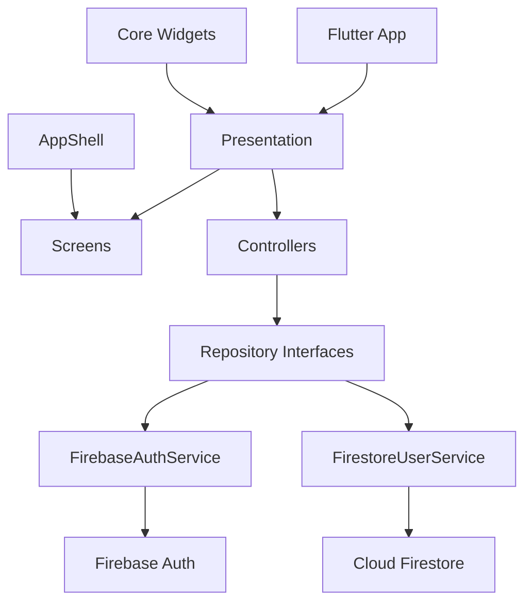

# Gromy

## Resumen ejecutivo

Gromy es una aplicacion movil multiplataforma orientada a la gestion y participacion en torneos deportivos amateur. Su objetivo es centralizar en una unica plataforma procesos que hoy suelen resolverse de forma dispersa mediante redes sociales, grupos de mensajeria y herramientas no especializadas.

La vision funcional definida en el plan del proyecto contempla que un usuario pueda:

- registrarse e iniciar sesion;
- crear torneos deportivos individuales o por equipos;
- descubrir torneos disponibles y cercanos a su ubicacion;
- inscribirse en torneos y consultar informacion detallada;
- gestionar participantes, calendario, resultados y clasificacion;
- interactuar con otros usuarios, equipos e invitaciones privadas;
- evolucionar hacia funcionalidades de monetizacion, verificacion y privacidad avanzada.

## Contexto del proyecto

La planificacion del proyecto se basa en Scrum y se organiza en iteraciones con entregas incrementales. El plan del producto define un backlog amplio, pero el MVP se centra en el flujo principal:

1. registro e inicio de sesion;
2. creacion y visualizacion de torneos;
3. inscripcion y consulta de informacion;
4. busqueda, filtrado y proximidad.

## Estado actual del repositorio

El estado actual del codigo refleja principalmente la fase inicial del proyecto y parte del Sprint 0:

- autenticacion con correo y contrasena mediante Firebase Auth;
- inicio de sesion social con Google y Apple;
- persistencia de perfil de usuario en Firestore;
- estructura base de navegacion de la app;
- componentes visuales reutilizables;
- pantallas base para inicio, eventos, notificaciones, perfil y creacion de torneos;
- bateria inicial de pruebas unitarias y widget tests.

Todavia no estan implementadas de forma completa las funcionalidades nucleares de torneos definidas en el backlog, como inscripcion, buscador avanzado, gestion de calendario, resultados, equipos, privacidad completa o monetizacion.

La geolocalizacion del formulario de torneos si cuenta ya con una implementacion funcional de mapa, seleccion manual por tap y geocodificacion, documentada aparte en la guia tecnica de geolocalizacion.

## Objetivos del producto

### Objetivo general

Construir una aplicacion multiplataforma para organizar, descubrir y gestionar torneos deportivos de forma sencilla, centralizada y escalable.

### Objetivos especificos

- reducir la friccion en la creacion y publicacion de torneos;
- facilitar el descubrimiento de competiciones relevantes para cada usuario;
- mejorar la gestion de participantes y la visibilidad de los eventos;
- sentar una base tecnica que permita evolucionar hacia un MVP completo y monetizable;
- trabajar con una metodologia agil que permita validar el producto sprint a sprint.

## Pila tecnologica

### Frontend

- Flutter
- Dart

### Backend y servicios

- Firebase Core
- Firebase Authentication
- Cloud Firestore
- Google Sign-In
- Sign in with Apple
- Stadia Maps
- MapTiler Geocoding
- Geolocator

### Calidad y soporte al desarrollo

- flutter_test
- flutter_lints
- pruebas unitarias y de widgets

## Estructura del repositorio

```text
gromy/
|-- assets/
|-- documentation/
|-- lib/
|   |-- app/
|   |-- core/
|   `-- features/
|       |-- auth/
|       |-- events/
|       |-- home/
|       |-- notifications/
|       |-- profile/
|       |-- tournament/
|       `-- user/
|-- test/
`-- pubspec.yaml
```

## Arquitectura a alto nivel

El proyecto sigue una estructura por funcionalidades y capas, con una separacion clara entre presentacion, contratos de repositorio y servicios de infraestructura.



## Mapa y geolocalizacion

La implementacion actual del mapa del formulario de torneos usa:

- `flutter_map` para renderizado;
- Stadia Maps para tiles;
- OpenMapTiles y OpenStreetMap como base cartografica;
- MapTiler para geocodificacion y geocodificacion inversa;
- `geolocator` para obtener la posicion actual del dispositivo.

Las API keys del sistema de mapa estan centralizadas en:

- `lib/features/tournament/config/map_provider_config.dart`

## Documentacion disponible

- [Arquitectura](C:\Users\ossam\Desktop\ULPGC\3year\2SEMESTRE\PS\proyecto%20PS\gromy\documentation\architecture.md)
- [Geolocalizacion y mapas](C:\Users\ossam\Desktop\ULPGC\3year\2SEMESTRE\PS\proyecto%20PS\gromy\documentation\geolocation.md)
- [Backlog del producto](C:\Users\ossam\Desktop\ULPGC\3year\2SEMESTRE\PS\proyecto%20PS\gromy\documentation\product-backlog.md)
- [Plan Scrum](C:\Users\ossam\Desktop\ULPGC\3year\2SEMESTRE\PS\proyecto%20PS\gromy\documentation\scrum-plan.md)

## Puesta en marcha

### Requisitos

- Flutter SDK compatible con Dart 3.11
- proyecto Firebase configurado
- plataformas Flutter habilitadas en el entorno local

### Comandos principales

```bash
flutter pub get
flutter run
flutter test
```

## Calidad y buenas practicas

- separacion por modulos funcionales;
- uso de interfaces de repositorio para reducir acoplamiento;
- controladores testeables mediante inyeccion de dependencias;
- suite automatizada de pruebas para logica critica, widgets y navegacion;
- backlog y roadmap trazables al plan Scrum del proyecto.

## Limitaciones y siguientes pasos

Para acercar el repositorio al alcance definido en el PDF, los siguientes pasos recomendados son:

1. implementar el dominio funcional de torneos, participantes e inscripciones;
2. anadir routing mas formal y gestion de estado escalable;
3. definir reglas de seguridad y modelos de datos de Firestore por modulo;
4. incorporar CI para lint, test y validacion de calidad;
5. completar la trazabilidad entre historias de usuario, tareas tecnicas y entregables por sprint.
