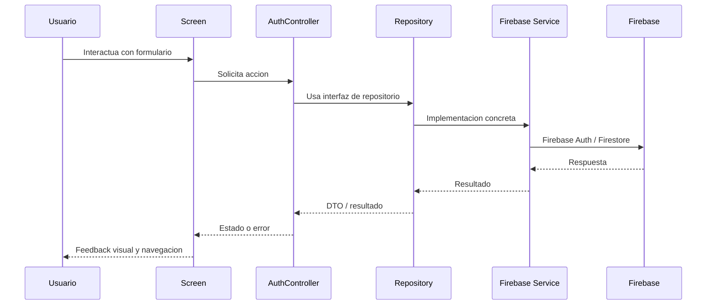

# Arquitectura del proyecto

## Objetivo

Este documento describe la arquitectura actual del proyecto Gromy, sus decisiones tecnicas principales y la evolucion recomendada para sostener el backlog definido en el plan del producto.

## Principios de diseño

La arquitectura actual persigue los siguientes principios:

- separacion de responsabilidades;
- bajo acoplamiento entre UI e infraestructura;
- modularidad por funcionalidad;
- mantenibilidad y escalabilidad incremental;
- testabilidad de la logica de presentacion.

## Estilo arquitectonico

El repositorio sigue una aproximacion hibrida entre arquitectura por capas y organizacion por features.

### Capas identificables

- `presentation`: pantallas, controladores y flujo de navegacion;
- `data`: modelos, contratos de repositorio y servicios concretos;
- `core`: widgets y recursos compartidos;
- `app`: shell y composicion principal de la aplicacion.

### Observacion importante

Aunque existe una separacion razonable entre contratos e infraestructura, la capa de dominio todavia no esta formalizada como un modulo independiente de casos de uso y entidades de negocio puras. Esto es aceptable en una fase temprana del proyecto, pero conviene introducirla cuando aumente la complejidad funcional de torneos, inscripciones, calendario y equipos.

## Estructura actual

```text
lib/
|-- app/
|   `-- app_shell.dart
|-- core/
|   |-- icons/
|   `-- widgets/
`-- features/
    |-- auth/
    |   |-- data/
    |   |   |-- models/
    |   |   |-- repositories/
    |   |   `-- services/
    |   `-- presentation/
    |       |-- controllers/
    |       `-- screens/
    |-- user/
    |   `-- data/
    |       |-- models/
    |       |-- repositories/
    |       `-- services/
    |-- home/
    |-- events/
    |-- notifications/
    |-- profile/
    `-- tournament/
```

## Modulos principales

### `app`

Responsable de ensamblar la navegacion principal de la aplicacion mediante `AppShell` y la barra inferior compartida.

### `core`

Contiene elementos reutilizables y transversales:

- widgets comunes;
- estilos visuales base;
- iconografia propia.

### `features/auth`

Concentra la autenticacion y el alta de usuario:

- modelos de resultado de autenticacion;
- contratos de repositorio;
- servicio concreto contra Firebase Auth;
- controlador de autenticacion;
- pantallas de login, registro y completado de perfil social.

### `features/user`

Gestiona el perfil del usuario en Firestore:

- modelo `AppUser`;
- interfaz `UserRepository`;
- servicio `FirestoreUserService`.

### `features/home`, `events`, `notifications`, `profile`, `tournament`

Representan la estructura funcional de la navegacion principal. En el estado actual varias de estas pantallas son placeholders, lo que indica que la arquitectura base esta preparada, pero gran parte del backlog de negocio sigue pendiente.

## Flujo tecnico principal



## Integraciones externas

### Firebase Authentication

Se utiliza para:

- registro con correo y contrasena;
- login con correo y contrasena;
- autenticacion social con Google y Apple;
- mantenimiento de sesion.

### Cloud Firestore

Se utiliza para:

- persistencia del perfil de usuario;
- verificacion de unicidad de nickname;
- base prevista para evolucionar hacia torneos, participantes, calendarios y resultados.

## Decisiones tecnicas relevantes

### 1. Flutter como base multiplataforma

Permite una unica base de codigo para Android, iOS, web y escritorio, reduciendo el coste de implementacion del prototipo.

### 2. Firebase como BaaS

Reduce el tiempo de construccion del backend y acelera la validacion funcional del producto.

### 3. Repositorios e interfaces

La UI no depende directamente de Firebase, sino de contratos (`AuthRepository`, `UserRepository`). Esto mejora la mantenibilidad y hace viable el testing con dobles de prueba.

### 4. Controladores de presentacion

`AuthController` concentra reglas de validacion, coordinacion de login/registro y mensajes de error. En el estado actual actua como una capa de aplicacion ligera.

### 5. Organizacion por features

Facilita escalar el producto conforme el backlog crezca, evitando una estructura monolitica centrada solo en capas tecnicas.

## Riesgos y deudas tecnicas actuales

### Riesgos

- ausencia de una capa de dominio formal;
- navegacion aun muy acoplada a `MaterialPageRoute` manual;
- gran parte del backlog funcional sigue sin modelo ni persistencia;
- trazas `print` en servicios de infraestructura que deberian sustituirse por logging estructurado;
- dependencia fuerte de Firebase en decisiones de datos y flujo.

### Deuda tecnica observable

- varias features principales aun son pantallas placeholder;
- no existe una documentacion tecnica consolidada previa;
- la estrategia de estado global aun es minima;
- faltan modelos y repositorios especificos para torneos, inscripciones, equipos y notificaciones.

## Evolucion recomendada

### Corto plazo

- crear modulos `tournament`, `registration`, `search` y `profile` con repositorios propios;
- introducir casos de uso para la logica central;
- formalizar un esquema de rutas;
- definir reglas de seguridad de Firestore y estructuras documentales.

### Medio plazo

- incorporar un sistema de estado mas escalable si aumenta la complejidad;
- anadir observabilidad, analitica y manejo de errores uniforme;
- automatizar calidad con CI y validaciones por pull request;
- extender la cobertura de pruebas a integracion y golden tests.

## Relacion con la documentacion Scrum

La arquitectura actual debe entenderse como la base tecnica del Sprint 0. Su mision principal es soportar las historias de usuario de autenticacion y sentar el esqueleto para la evolucion del MVP. La priorizacion funcional y la planificacion temporal se documentan en [scrum-plan.md](C:\Users\ossam\Desktop\ULPGC\3year\2SEMESTRE\PS\proyecto%20PS\gromy\documentation\scrum-plan.md) y [product-backlog.md](C:\Users\ossam\Desktop\ULPGC\3year\2SEMESTRE\PS\proyecto%20PS\gromy\documentation\product-backlog.md).
