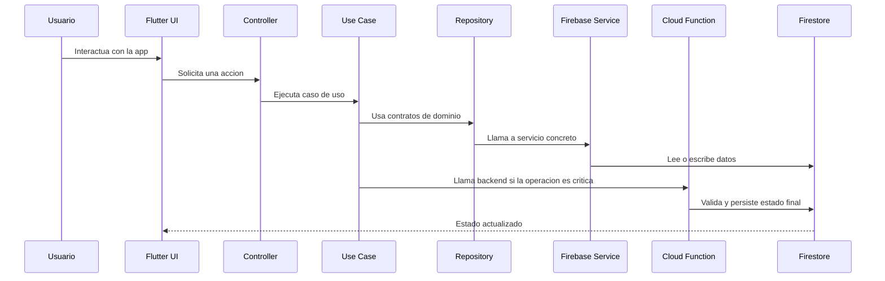

# Arquitectura del proyecto

## Objetivo

Este documento describe la arquitectura recomendada para Gromy a partir del estado actual del repositorio y del backlog funcional del proyecto. Su objetivo es aclarar:

- que responsabilidad tiene cada modulo tecnico;
- por que existen varios servicios y repositorios en lugar de una unica clase global;
- como integrar Firebase Authentication, Cloud Firestore y Cloud Functions sin acoplar la app a una sola capa monolitica;
- como preparar el sistema para crecer hacia torneos, inscripciones, brackets, notificaciones y monetizacion.

## Principios de diseño

La arquitectura del proyecto debe apoyarse en estos principios:

- separacion de responsabilidades;
- bajo acoplamiento entre UI, logica de negocio e infraestructura;
- modularidad por dominio funcional;
- escalabilidad incremental sin reescrituras tempranas;
- testabilidad de la logica critica;
- seguridad por defecto en operaciones sensibles;
- backend como fuente de verdad para reglas de negocio importantes.

## Vision general

Gromy es una aplicacion Flutter multiplataforma con Firebase como plataforma principal de backend. La app cliente debe encargarse sobre todo de:

- renderizar interfaces;
- recoger interacciones del usuario;
- validar datos a nivel de experiencia de usuario;
- consumir repositorios y casos de uso;
- reflejar el estado del sistema.

La logica de negocio critica no debe depender exclusivamente del cliente. Operaciones como:

- aceptar o rechazar inscripciones;
- generar brackets;
- controlar aforo;
- propagar ganadores de partidos;
- enviar notificaciones;
- validar pagos o privilegios premium;

deben resolverse en backend mediante Cloud Functions y persistirse en Firestore.

## Estilo arquitectonico

El proyecto sigue una arquitectura por features con capas internas. Es una aproximacion adecuada para el alcance actual y para la evolucion prevista del MVP.

### Capas recomendadas

- `presentation`: pantallas, widgets, controladores y navegacion;
- `application`: casos de uso y coordinacion de flujos;
- `domain`: entidades y reglas de negocio puras;
- `data`: repositorios, DTOs y servicios concretos;
- `core`: utilidades transversales, estilos, componentes y helpers compartidos;
- `backend`: Cloud Functions, validaciones server-side y automatismos del sistema.

### Observacion importante

En el estado actual del repositorio existe separacion parcial entre presentacion y datos, pero la capa de dominio todavia es ligera. Esto es razonable en una fase temprana, pero conviene formalizarla antes de implementar:

- torneos completos;
- inscripciones con aforo;
- brackets y partidos;
- clasificaciones;
- permisos de administradores del torneo;
- monetizacion o funcionalidades premium.

## Estructura actual del repositorio

```text
lib/
|-- app/
|   `-- app_shell.dart
|-- core/
|   |-- icons/
|   `-- widgets/
|-- database/
|   |-- registration/
|   |-- session/
|-- features/
|   |-- auth/
|   |-- events/
|   |-- home/
|   |-- notifications/
|   |-- profile/
|   |-- tournament/
|   `-- user/
`-- test/
```

## Interpretacion de los modulos actuales

La estructura actual ya apunta en una buena direccion. Es importante entender que tener varios servicios no significa tener varias bases de datos.

### Servicios actuales y su responsabilidad

- `auth`: autenticacion y proveedores de acceso con Firebase Auth;
- `user`: perfil de usuario persistido en Firestore;
- `registration`: flujo de alta con verificacion de correo y datos temporales;
- `session`: resolucion del estado de acceso de la app;

Esto es correcto porque cada modulo representa una responsabilidad distinta del sistema.

## Por que no usar un unico servicio global

Una clase unica tipo `AppService`, `DatabaseService` o `FirebaseService` puede parecer mas simple al principio, pero a medio plazo introduce varios problemas:

- mezcla autenticacion, perfiles, torneos, inscripciones y notificaciones en un mismo punto;
- aumenta el acoplamiento entre pantallas y servicios;
- dificulta las pruebas unitarias;
- favorece duplicacion de logica;
- hace mas costoso evolucionar el producto.

La recomendacion arquitectonica es mantener servicios y repositorios separados por dominio funcional, no fusionarlo todo en una sola pieza.

## Servicios, repositorios y casos de uso

Para que la arquitectura escale bien, conviene distinguir tres conceptos:

### Servicios

Hablan con la tecnologia concreta.

Ejemplos:

- `FirebaseAuthService`
- `FirestoreUserService`
- futuros servicios de Firestore para torneos, partidos o notificaciones

### Repositorios

Definen contratos estables para que la aplicacion no dependa directamente de Firebase.

Ejemplos:

- `AuthRepository`
- `UserRepository`
- futuros `TournamentRepository`, `RegistrationRepository`, `MatchRepository`

### Casos de uso

Coordinan la logica de negocio y varios repositorios.

Ejemplos recomendados:

- `createTournament`
- `joinTournament`
- `cancelRegistration`
- `generateBracket`
- `reportMatchResult`
- `approveRegistration`

## Flujo tecnico recomendado



## Integraciones externas

### Firebase Authentication

Debe utilizarse para:

- registro con correo y contrasena;
- login con correo y contrasena;
- autenticacion social con Google y Apple;
- mantenimiento de sesion;
- verificacion de correo electronico.

### Cloud Firestore

Debe utilizarse para:

- perfiles de usuario;
- torneos;
- inscripciones;
- partidos y brackets materializados;
- notificaciones internas;
- relaciones sociales o equipos cuando lleguen a implementarse.

### Cloud Functions

Debe utilizarse para:

- operaciones criticas de negocio;
- automatismos del sistema;
- validaciones que no deben confiarse al cliente;
- generacion de brackets;
- propagacion de resultados;
- notificaciones push o eventos de sistema;
- logica premium o pagos.

### Firebase Cloud Messaging

Debe utilizarse para notificaciones push, siempre coordinadas desde backend y no solo desde el cliente.

### App Check

Debe incorporarse antes de abrir el sistema a usuarios reales para reducir abuso automatizado sobre Firestore y Functions.

## Modelo de crecimiento por dominios

Para escalar sin perder claridad, se recomienda organizar la evolucion del sistema por dominios funcionales.

### 1. Identidad y acceso

Responsabilidades:

- autenticacion;
- perfil de usuario;
- estado de sesion;
- privacidad basica de cuenta.

Modulos:

- `features/auth`
- `features/user`
- `database/registration`
- `database/session`

### 2. Torneos

Responsabilidades:

- crear torneo;
- editar configuracion;
- definir tipo de torneo;
- gestionar administradores;
- cerrar inscripciones.

Modulos recomendados:

- `features/tournament`
- futuro `features/tournament/data`
- futuro `features/tournament/application`

### 3. Inscripciones

Responsabilidades:

- solicitar plaza;
- aprobar o rechazar solicitud;
- cancelar inscripcion;
- controlar aforo.

Modulos recomendados:

- futuro `features/registration`

### 4. Brackets y partidos

Responsabilidades:

- generar cuadro;
- almacenar partidos;
- registrar ganadores;
- actualizar rondas;
- gestionar clasificacion.

Modulos recomendados:

- futuro `features/bracket`
- futuro `features/match`
- soporte fuerte en Cloud Functions

### 5. Descubrimiento

Responsabilidades:

- listado de torneos;
- filtros;
- busqueda;
- proximidad geográfica.

Modulos recomendados:

- futuro `features/search`
- futuro `features/discovery`

### 6. Notificaciones y social

Responsabilidades:

- notificaciones internas;
- push notifications;
- invitaciones;
- amigos, bloqueos y reportes si se implementan.

Modulos recomendados:

- `features/notifications`
- futuro `features/social`

## Arquitectura recomendada para torneos y brackets

Los brackets no deben modelarse como un unico array gigante dentro de un documento de torneo. Para Firestore es mucho mas sano usar subcolecciones y documentos independientes.

### Colecciones recomendadas

```text
users/{uid}
tournaments/{tournamentId}
tournaments/{tournamentId}/admins/{uid}
tournaments/{tournamentId}/registrations/{registrationId}
tournaments/{tournamentId}/matches/{matchId}
tournaments/{tournamentId}/standings/{entryId}
notifications/{notificationId}
teams/{teamId}
```

### Ventajas de esta aproximacion

- permite leer solo lo necesario;
- evita documentos demasiado grandes;
- mejora concurrencia y mantenimiento;
- facilita recalculo parcial del bracket;
- soporta mejor filtros, estados y auditoria.

### Formatos de torneo recomendados

Para el MVP:

- `single_elimination`

Como siguiente paso razonable:

- `round_robin`

Para mas adelante:

- `double_elimination`
- `group_stage_plus_playoff`

## Que logica debe vivir en cliente y cual en backend

### Cliente Flutter

Debe encargarse de:

- formularios;
- navegacion;
- feedback visual;
- validacion basica de campos;
- renderizado de listas y pantallas;
- consumo de repositorios y casos de uso.

### Backend con Cloud Functions

Debe encargarse de:

- validar permisos reales;
- evitar sobreinscripciones;
- generar brackets;
- actualizar clasificaciones;
- propagar resultados a siguientes rondas;
- crear notificaciones de sistema;
- ejecutar logica de pago o privilegios premium.

## Cloud Functions: TypeScript o Python

Para este proyecto, la opcion recomendada es TypeScript.

### Ventajas de TypeScript en Gromy

- mejor alineacion con el ecosistema Firebase y FlutterFire;
- documentacion y ejemplos oficiales mas abundantes;
- integracion muy natural con Cloud Functions;
- menor complejidad operativa para un equipo que ya trabaja con frontend y arquitectura cercana a TypeScript;
- buena experiencia para modelar contratos, DTOs y reglas de negocio.

### Cuando tendria sentido Python

Python tendria sentido si el proyecto necesitara claramente:

- procesamiento intensivo de datos;
- machine learning;
- pipelines analiticos;
- librerias especificas del ecosistema Python.

Para el MVP y para la logica de torneos, TypeScript es normalmente la mejor eleccion.

## Riesgos tecnicos actuales

### 1. Falta de capa de dominio formal

Si el proyecto sigue creciendo sin casos de uso ni entidades de negocio claras, aumentara el acoplamiento entre pantallas y Firebase.

### 2. Reglas de seguridad no formalizadas en el repositorio

Sin reglas versionadas y revisables, no hay garantia real de seguridad sobre Firestore o futuras operaciones sensibles.

### 3. Logica critica demasiado cerca del cliente

Si inscripciones, aforo, resultados o brackets se calculan en Flutter, el sistema sera fragile y manipulable.

### 4. Fragmentacion accidental de servicios

Separar responsabilidades es correcto, pero si los servicios empiezan a solaparse o duplicar reglas, aparecera deuda tecnica.

### 5. Features clave aun como placeholders

La base de navegacion existe, pero gran parte del backlog funcional aun no esta modelado ni persistido.

## Riesgos futuros si no se corrige la direccion

- duplicacion de logica entre cliente y backend;
- operaciones inconsistentes por concurrencia;
- imposibilidad de garantizar unicidad o aforo;
- reglas de permisos demasiado complejas en pantallas;
- backend improvisado para monetizacion;
- dificultad para mantener pruebas y evolucionar el producto.

## Errores comunes que conviene evitar

- crear un servicio gigante para toda la app;
- mezclar autenticacion y perfil como si fueran la misma entidad;
- permitir escrituras sensibles directamente desde cliente;
- guardar todo el bracket en un solo documento;
- no usar transacciones en aforo e inscripciones;
- modelar permisos de torneo solo con flags en cliente;
- retrasar demasiado la definicion de reglas de seguridad;
- introducir pagos antes de tener estable el flujo principal del MVP.

## Evolucion recomendada

### Corto plazo

- mantener separados `auth`, `user`, `registration` y `session`;
- introducir casos de uso para flujos importantes;
- definir un modelo de datos formal para torneos e inscripciones;
- versionar reglas de Firestore y Storage;
- preparar la estructura de Cloud Functions en TypeScript.

### Medio plazo

- crear modulos especificos para torneos, inscripciones y brackets;
- mover logica critica a backend;
- introducir notificaciones push y eventos de sistema;
- reforzar trazabilidad entre backlog y modulos tecnicos;
- ampliar pruebas hacia flujos funcionales completos.

### Largo plazo

- monetizacion;
- verificacion de organizadores;
- funciones premium;
- social y moderacion;
- observabilidad y analitica avanzadas.

## Relacion con Scrum y backlog

La arquitectura debe servir al MVP, no al reves. El backlog del proyecto es amplio, pero la prioridad tecnica deberia concentrarse en:

- identidad;
- creacion y consulta de torneos;
- inscripcion;
- detalle del torneo;
- filtros y proximidad;
- base de brackets y resultados.

Todo lo demas deberia incorporarse cuando estas piezas sean estables y seguras.

## Conclusiones

La arquitectura actual de Gromy va en una direccion correcta: separar autenticacion, perfil, registro y sesion no es un problema, sino una buena base. Lo importante no es reducir el numero de servicios artificialmente, sino asegurarse de que:

- cada uno tenga una responsabilidad clara;
- los contratos de repositorio sigan limpios;
- la logica critica se traslade al backend;
- Firestore se modele por dominios y no como un contenedor unico;
- el sistema se prepare desde ya para torneos, inscripciones y brackets escalables.
