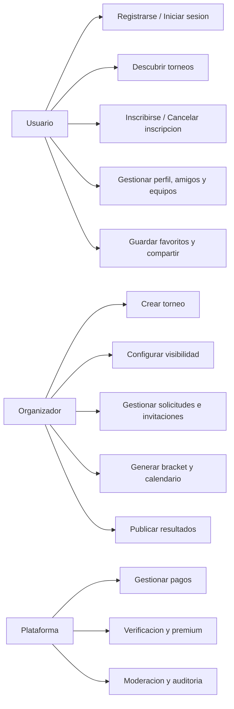
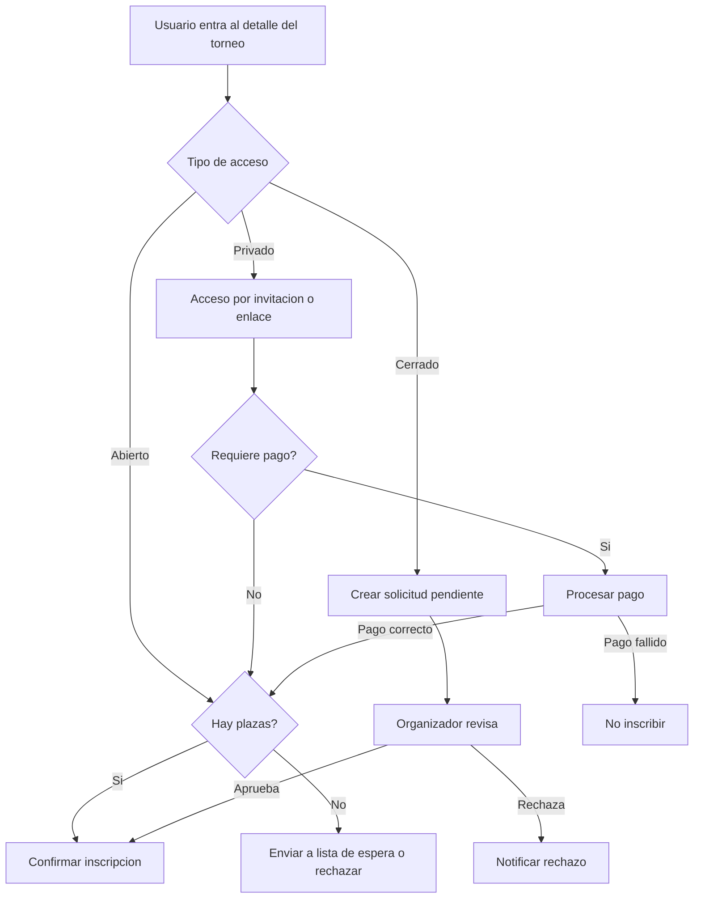
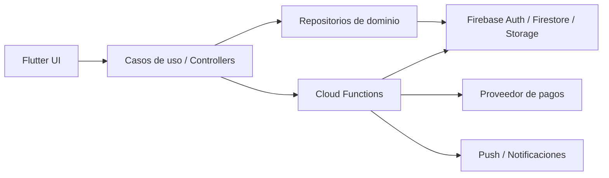

# Gromy
## Backlog Scrum Ampliado y Reorganizado

**Proyecto:** Aplicacion movil para gestion de torneos deportivos  
**Asignatura:** Produccion de Software  
**Fuente base:** `Plan proyecto PS (4) (4).pdf`  
**Version:** 1.0  
**Fecha de elaboracion:** 2026-05-05  
**Objetivo del documento:** convertir la planificacion original en un backlog profesional, listo para trabajo real de equipo Scrum y para su posterior importacion a Google Docs.

---

## Indice

1. [Resumen ejecutivo](#1-resumen-ejecutivo)
2. [Alcance funcional reorganizado](#2-alcance-funcional-reorganizado)
3. [Criterios de calidad del backlog](#3-criterios-de-calidad-del-backlog)
4. [Historias de usuario por modulos](#4-historias-de-usuario-por-modulos)
5. [Reglas de negocio transversales](#5-reglas-de-negocio-transversales)
6. [Requisitos no funcionales](#6-requisitos-no-funcionales)
7. [Riesgos del proyecto](#7-riesgos-del-proyecto)
8. [Diagramas de apoyo](#8-diagramas-de-apoyo)
9. [Metricas de calidad](#9-metricas-de-calidad)
10. [Recomendaciones para backlog de Sprint 2](#10-recomendaciones-para-backlog-de-sprint-2)
11. [Conclusiones y recomendaciones finales](#11-conclusiones-y-recomendaciones-finales)

---

## 1. Resumen ejecutivo

### 1.1 Contexto del producto

Gromy es una aplicacion movil multiplataforma orientada a la creacion, descubrimiento, inscripcion y gestion de torneos deportivos amateur. El documento original plantea un MVP centrado en autenticacion, creacion de torneos, descubrimiento, proximidad, busqueda, filtrado e inscripcion. Sobre esa base, este documento reordena y amplifica el backlog para que pueda usarse en un entorno Scrum real.

### 1.2 Vision del producto

La propuesta de valor principal es centralizar en una unica plataforma aquello que en el contexto amateur suele gestionarse con redes sociales, grupos de mensajeria y herramientas poco especializadas:

- organizacion de torneos;
- gestion de participantes;
- visibilidad de eventos cercanos;
- interaccion social entre usuarios y equipos;
- invitaciones y privacidad;
- monetizacion controlada para organizadores y plataforma.

### 1.3 Tecnologias identificadas en el PDF

- `Flutter` para la app multiplataforma.
- `Dart` para la logica de aplicacion.
- `Firebase Authentication` para acceso y sesion.
- `Cloud Firestore` para persistencia principal.
- `Cloud Storage` para activos multimedia.
- `Figma` para prototipado visual.
- `Scrum` como marco de trabajo.

### 1.4 Principios usados para esta version ampliada

- mantener la intencion funcional original del PDF;
- normalizar todas las historias en formato profesional;
- añadir criterios Given / When / Then verificables;
- explicitar reglas de negocio, dependencias y notas tecnicas;
- proponer historias faltantes y backlog adicional donde el flujo quedaba incompleto.

---

## 2. Alcance funcional reorganizado

### 2.1 Modulos funcionales

1. Acceso, identidad y perfil.
2. Descubrimiento, detalle e inscripcion en torneos.
3. Gestion operativa de torneos.
4. Equipos, relaciones sociales y privacidad.
5. Monetizacion, confianza y funciones premium.

### 2.2 MVP identificado a partir del PDF

El MVP original queda trazado sobre estas historias:

- HU1 Registro de usuario
- HU2 Inicio de sesion
- HU3 Crear torneo
- HU4 Ver torneos disponibles
- HU5 Sistema de inscripcion en torneos
- HU6 Ver torneos cercanos
- HU8 Filtrar torneos
- HU11 Ver informacion detallada del torneo
- HU19 Buscar torneos

### 2.3 Historias originales detectadas

- Historias base del PDF: `HU1` a `HU39`
- Historias premium del PDF: `HU-PRO-01` a `HU-PRO-06`
- Historias nuevas solicitadas en este encargo: `HU40` a `HU54`
- Historias adicionales propuestas en este documento: `HU55` a `HU58`

---

## 3. Criterios de calidad del backlog

### 3.1 Convenciones aplicadas

Cada historia contiene:

- redaccion en formato `Como [rol], quiero [objetivo], para [beneficio]`;
- descripcion detallada;
- criterios de aceptacion en formato Given / When / Then;
- casos alternativos;
- escenarios de error o excepcion;
- reglas de negocio;
- dependencias;
- notas tecnicas.

### 3.2 Definition of Ready recomendada

Una historia deberia entrar a sprint solo si:

- el objetivo funcional esta claro;
- los criterios de aceptacion son verificables;
- existen dependencias identificadas;
- el tamano es asumible dentro del sprint;
- el equipo conoce el impacto en datos, UI, backend y testing.

### 3.3 Definition of Done recomendada

Una historia se considerara completada cuando:

- este implementada end to end;
- cumpla criterios funcionales y reglas de negocio;
- tenga pruebas adecuadas al riesgo;
- este integrada sin regresiones;
- disponga de evidencia de demo o QA.

---

## 4. Historias de usuario por modulos

## 4.1 Acceso, identidad y perfil

### HU1 - Registro de usuario

**Historia:** Como visitante, quiero registrarme en la aplicacion, para crear una cuenta y participar en torneos deportivos.  
**Prioridad original:** Alta  
**Estimacion original:** 5 puntos

**Descripcion detallada**  
El sistema debe permitir el alta de usuarios mediante correo y contrasena, validando formato, unicidad y condiciones minimas de seguridad antes de crear la cuenta.

**Criterios de aceptacion**

| ID | Given | When | Then |
|---|---|---|---|
| HU1-CA1 | Given que el visitante esta en la pantalla de registro | When introduce correo valido y contrasena valida | Then el sistema crea la cuenta y abre sesion |
| HU1-CA2 | Given que el correo ya existe | When intenta registrarse | Then el sistema bloquea el alta e informa el motivo |
| HU1-CA3 | Given que faltan datos obligatorios o el formato es invalido | When envia el formulario | Then el sistema muestra validaciones en pantalla |

**Casos alternativos**  
Registro con verificacion de correo antes de habilitar ciertas acciones sensibles.

**Excepciones**  
Correo duplicado, contrasena debil, fallo de red, fallo del proveedor de autenticacion.

**Reglas de negocio**  
La cuenta debe estar asociada a un identificador unico. La contrasena no puede tener menos de 6 caracteres.

**Dependencias**  
Firebase Authentication, modelo base de usuario, pantalla de onboarding.

**Notas tecnicas**  
Separar autenticacion de persistencia de perfil; crear documento de usuario en Firestore tras alta correcta.

### HU2 - Inicio de sesion

**Historia:** Como usuario registrado, quiero iniciar sesion, para acceder a mi cuenta y operar en la plataforma.  
**Prioridad original:** Alta  
**Estimacion original:** 3 puntos

**Descripcion detallada**  
El sistema debe autenticar usuarios existentes y mantener el estado de sesion de forma estable entre aperturas de la aplicacion.

**Criterios de aceptacion**

| ID | Given | When | Then |
|---|---|---|---|
| HU2-CA1 | Given que el usuario dispone de credenciales validas | When inicia sesion | Then accede a la aplicacion y a su contexto personal |
| HU2-CA2 | Given que las credenciales son incorrectas | When intenta acceder | Then el sistema deniega el acceso y muestra error |
| HU2-CA3 | Given que el usuario esta autenticado | When cierra sesion | Then la sesion se invalida y vuelve al acceso |

**Casos alternativos**  
Inicio con proveedor social si el producto lo habilita mas adelante.

**Excepciones**  
Cuenta deshabilitada, red caida, sesion caducada.

**Reglas de negocio**  
No deben exponerse detalles de seguridad internos en mensajes de error.

**Dependencias**  
HU1, gestion de sesion.

**Notas tecnicas**  
Persistir token de sesion de forma segura y escuchar cambios de autenticacion.

### HU15 - Editar perfil de usuario

**Historia:** Como usuario, quiero editar mi perfil, para mantener actualizada mi informacion personal.  
**Prioridad original:** Media  
**Estimacion original:** 3 puntos

**Descripcion detallada**  
Permite actualizar alias, foto, biografia y otros campos visibles en la plataforma, respetando reglas de validacion y privacidad.

**Criterios de aceptacion**

| ID | Given | When | Then |
|---|---|---|---|
| HU15-CA1 | Given que el usuario accede a su perfil | When modifica datos validos | Then el sistema guarda y refleja los cambios |
| HU15-CA2 | Given que la informacion no cumple validaciones | When intenta guardar | Then el sistema rechaza el cambio e informa el error |

**Casos alternativos**  
Actualizacion parcial sin cambiar foto ni biografia.

**Excepciones**  
Imagen no soportada, perdida de conexion, conflicto de escritura.

**Reglas de negocio**  
El nombre visible debe ser unico si el producto define alias unico; los cambios no deben vulnerar la configuracion de privacidad.

**Dependencias**  
HU1, almacenamiento de imagenes, HU27.

**Notas tecnicas**  
Aplicar compresion y limite de tamano a las imagenes antes de subirlas.

### HU16 - Eliminar cuenta de usuario

**Historia:** Como usuario, quiero eliminar mi cuenta, para dejar de usar la plataforma y retirar mis datos personales.  
**Prioridad original:** Baja  
**Estimacion original:** 5 puntos

**Descripcion detallada**  
La eliminacion debe retirar acceso y ejecutar una estrategia clara sobre datos personales, participaciones e historico.

**Criterios de aceptacion**

| ID | Given | When | Then |
|---|---|---|---|
| HU16-CA1 | Given que el usuario accede a la opcion de eliminar cuenta | When confirma la accion | Then el sistema elimina el acceso y procesa la baja |
| HU16-CA2 | Given que la baja afecta a torneos o equipos activos | When se confirma | Then el sistema aplica las reglas de negocio definidas |

**Casos alternativos**  
Desactivacion logica temporal en lugar de borrado fisico para trazabilidad.

**Excepciones**  
Cuenta con pagos en curso, usuario organizador de torneo sin traspaso, fallo de backend.

**Reglas de negocio**  
No puede dejar torneos sin responsable; se debe conservar la minima trazabilidad requerida por normativa y soporte.

**Dependencias**  
HU10, HU20, HU30.

**Notas tecnicas**  
Implementar flujo coordinado entre Auth, Firestore y Storage.

### HU17 - Ver perfil de otros usuarios

**Historia:** Como usuario, quiero ver el perfil de otros jugadores, para conocer su informacion publica antes de interactuar o competir.  
**Prioridad original:** Media  
**Estimacion original:** 3 puntos

**Descripcion detallada**  
El sistema debe exponer solo la informacion autorizada por configuracion de privacidad y el contexto de relacion.

**Criterios de aceptacion**

| ID | Given | When | Then |
|---|---|---|---|
| HU17-CA1 | Given que el perfil es visible para el solicitante | When accede al perfil | Then visualiza la informacion habilitada |
| HU17-CA2 | Given que el perfil es privado o restringido | When intenta acceder | Then el sistema bloquea la vista y muestra el motivo general |

**Casos alternativos**  
Acceso desde lista de participantes, busqueda o lista de amigos.

**Excepciones**  
Usuario bloqueado, perfil eliminado, datos parcialmente no disponibles.

**Reglas de negocio**  
La visibilidad depende de HU27 y del estado de amistad o bloqueo.

**Dependencias**  
HU22, HU23, HU25, HU27.

**Notas tecnicas**  
Resolver visibilidad en backend o reglas de seguridad, no solo en cliente.

### HU18 - Historial de torneos del usuario

**Historia:** Como usuario, quiero ver mi historial de torneos, para consultar mis participaciones anteriores.  
**Prioridad original:** Media  
**Estimacion original:** 5 puntos

**Descripcion detallada**  
Debe mostrar torneos pasados en los que el usuario participo, con acceso a resultados y detalle historico cuando proceda.

**Criterios de aceptacion**

| ID | Given | When | Then |
|---|---|---|---|
| HU18-CA1 | Given que el usuario tiene participaciones historicas | When entra en su historial | Then ve el listado ordenado por fecha |
| HU18-CA2 | Given que selecciona un torneo historico | When abre el detalle | Then accede a informacion relevante del torneo finalizado |

**Casos alternativos**  
Historial vacio con mensaje informativo.

**Excepciones**  
Torneos anonimizados, datos incompletos por migracion.

**Reglas de negocio**  
Solo deben mostrarse participaciones confirmadas o finalizadas, no solicitudes rechazadas.

**Dependencias**  
HU5, HU13, HU51.

**Notas tecnicas**  
Conviene indexar por `userId` y fecha de finalizacion.

### HU27 - Configurar privacidad del perfil

**Historia:** Como usuario, quiero configurar la privacidad de mi perfil, para controlar quien puede ver mi informacion.  
**Prioridad original:** Media  
**Estimacion original:** 5 puntos

**Descripcion detallada**  
El usuario define si su perfil es publico, visible solo para amigos o privado, y el sistema aplica esa decision de forma consistente.

**Criterios de aceptacion**

| ID | Given | When | Then |
|---|---|---|---|
| HU27-CA1 | Given que el usuario accede a privacidad | When selecciona un nivel valido | Then el sistema guarda y aplica la configuracion |
| HU27-CA2 | Given que otro usuario consulta el perfil | When no cumple las condiciones de visibilidad | Then el sistema restringe el acceso |

**Casos alternativos**  
Cambio de privacidad con efecto inmediato.

**Excepciones**  
Inconsistencias de caché, relacion de amistad desactualizada.

**Reglas de negocio**  
Los perfiles privados siguen mostrando una minima identidad si existe relacion administrativa o participacion compartida requerida.

**Dependencias**  
HU17, HU23, HU25.

**Notas tecnicas**  
Las reglas deben estar respaldadas por Firestore Security Rules.

### HU55 - Recuperar contrasena

**Historia:** Como usuario, quiero recuperar mi contrasena, para volver a acceder si olvido mis credenciales.  
**Prioridad propuesta:** Alta  
**Estimacion propuesta:** 3 puntos

**Descripcion detallada**  
Aunque no aparece explicita en el PDF, es una pieza basica de cualquier flujo de acceso operativo.

**Criterios de aceptacion**

| ID | Given | When | Then |
|---|---|---|---|
| HU55-CA1 | Given que el usuario indica un correo registrado | When solicita recuperacion | Then el sistema envia un enlace o instruccion de restablecimiento |
| HU55-CA2 | Given que el correo no existe o no es valido | When solicita recuperacion | Then el sistema responde sin filtrar informacion sensible |

**Casos alternativos**  
Reenvio del correo de recuperacion.

**Excepciones**  
Proveedor de correo no disponible, enlace expirado.

**Reglas de negocio**  
No se debe confirmar explicitamente si una cuenta existe en el sistema.

**Dependencias**  
HU1, HU2.

**Notas tecnicas**  
Aprovechar capacidades nativas del proveedor de autenticacion.

## 4.2 Descubrimiento, detalle e inscripcion

### HU4 - Ver torneos disponibles

**Historia:** Como usuario, quiero ver los torneos disponibles, para decidir en cuales me interesa participar.  
**Prioridad original:** Alta  
**Estimacion original:** 5 puntos

**Descripcion detallada**  
El sistema mostrara un listado navegable de torneos visibles para el usuario, con informacion basica y orden coherente.

**Criterios de aceptacion**

| ID | Given | When | Then |
|---|---|---|---|
| HU4-CA1 | Given que existen torneos visibles | When el usuario abre el listado | Then ve nombre, deporte, fecha y ubicacion |
| HU4-CA2 | Given que no existen torneos visibles | When accede al listado | Then el sistema muestra estado vacio informativo |

**Casos alternativos**  
Paginacion o scroll infinito.

**Excepciones**  
Fallo de consulta, permisos insuficientes.

**Reglas de negocio**  
No deben mostrarse torneos privados salvo acceso autorizado.

**Dependencias**  
HU3, HU9.

**Notas tecnicas**  
Necesario soporte de indices para orden por fecha.

### HU5 - Sistema de inscripcion en torneos

**Historia:** Como usuario, quiero inscribirme en torneos, para participar segun el tipo de acceso definido por el organizador.  
**Prioridad original:** Alta  
**Estimacion original:** 3 puntos

**Descripcion detallada**  
La inscripcion debe soportar acceso abierto, acceso con aprobacion y control de aforo, evitando inconsistencias de plazas.

**Criterios de aceptacion**

| ID | Given | When | Then |
|---|---|---|---|
| HU5-CA1 | Given que el torneo tiene inscripcion abierta y plazas | When el usuario se inscribe | Then el sistema confirma la plaza y actualiza participantes |
| HU5-CA2 | Given que el torneo requiere aprobacion | When el usuario solicita inscripcion | Then la solicitud queda en estado pendiente |
| HU5-CA3 | Given que no hay plazas disponibles | When intenta inscribirse | Then el sistema impide el alta y comunica el motivo |

**Casos alternativos**  
Inscripcion por equipo en torneos grupales.

**Excepciones**  
Colision de aforo, pago fallido, usuario bloqueado por organizador.

**Reglas de negocio**  
El aforo no puede superarse. El usuario no puede duplicar su inscripcion en el mismo torneo.

**Dependencias**  
HU3, HU9, HU22, HU34, HU54, HU56.

**Notas tecnicas**  
Resolver confirmacion y aforo con transacciones o funciones backend.

### HU6 - Ver torneos cercanos

**Historia:** Como usuario, quiero ver torneos cercanos a mi ubicacion, para descubrir competiciones proximas.  
**Prioridad original:** Media  
**Estimacion original:** 5 puntos

**Descripcion detallada**  
El sistema utilizara geolocalizacion para priorizar torneos por proximidad sin bloquear la experiencia cuando no haya permisos.

**Criterios de aceptacion**

| ID | Given | When | Then |
|---|---|---|---|
| HU6-CA1 | Given que el usuario concede permiso de ubicacion | When accede a torneos cercanos | Then ve los torneos ordenados por distancia |
| HU6-CA2 | Given que el permiso no se concede | When intenta usar la funcionalidad | Then el sistema ofrece una alternativa sin proximidad |

**Casos alternativos**  
Uso de ubicacion manual o ultima ubicacion conocida.

**Excepciones**  
GPS inactivo, precision baja, servicio de ubicacion no disponible.

**Reglas de negocio**  
La ubicacion del usuario no debe almacenarse permanentemente sin consentimiento explicito.

**Dependencias**  
HU4, servicio de geolocalizacion.

**Notas tecnicas**  
Calcular distancia en backend o cliente segun volumen y coste.

### HU8 - Filtrar torneos

**Historia:** Como usuario, quiero filtrar torneos, para encontrar mas rapido los que me interesan.  
**Prioridad original:** Alta  
**Estimacion original:** 2 puntos

**Descripcion detallada**  
Permite refinar el listado por deporte, fecha, ubicacion y numero de participantes, manteniendo una experiencia fluida.

**Criterios de aceptacion**

| ID | Given | When | Then |
|---|---|---|---|
| HU8-CA1 | Given que el usuario aplica uno o mas filtros | When confirma o modifica criterios | Then el listado se actualiza conforme a ellos |
| HU8-CA2 | Given que ningun torneo cumple los filtros | When se aplica la busqueda | Then el sistema informa que no hay resultados |

**Casos alternativos**  
Combinacion de filtros con busqueda por texto.

**Excepciones**  
Filtros incompatibles, indices no disponibles.

**Reglas de negocio**  
Los filtros no deben devolver torneos privados no autorizados.

**Dependencias**  
HU4, HU6, HU19.

**Notas tecnicas**  
Definir que filtros se resuelven en consulta y cuales en cliente.

### HU11 - Ver informacion detallada del torneo

**Historia:** Como usuario, quiero ver la informacion detallada de un torneo, para decidir si me interesa participar.  
**Prioridad original:** Alta  
**Estimacion original:** 1 punto

**Descripcion detallada**  
La pantalla de detalle debe actuar como punto central para informacion, inscripcion, participantes, normas y estado del torneo.

**Criterios de aceptacion**

| ID | Given | When | Then |
|---|---|---|---|
| HU11-CA1 | Given que el usuario abre un torneo visible para el | When carga la pantalla de detalle | Then ve descripcion, fecha, ubicacion, organizador y participantes |
| HU11-CA2 | Given que el torneo permite inscripcion al usuario | When consulta el detalle | Then puede iniciar la accion correspondiente |

**Casos alternativos**  
Detalle parcial para invitados aun no inscritos.

**Excepciones**  
Torneo borrado, permisos insuficientes, datos incompletos.

**Reglas de negocio**  
La informacion economica y de privacidad debe estar visible antes de confirmar inscripcion.

**Dependencias**  
HU4, HU5, HU9, HU22, HU33, HU54.

**Notas tecnicas**  
Conviene estructurar subcolecciones o vistas agregadas para evitar demasiadas lecturas.

### HU14 - Cancelar inscripcion en torneo

**Historia:** Como usuario, quiero cancelar mi inscripcion en un torneo, para liberar mi plaza si finalmente no participo.  
**Prioridad original:** Media  
**Estimacion original:** 2 puntos

**Descripcion detallada**  
La baja debe ser confirmada por el usuario y reflejarse en plazas, listas de espera y notificaciones relacionadas.

**Criterios de aceptacion**

| ID | Given | When | Then |
|---|---|---|---|
| HU14-CA1 | Given que el usuario esta inscrito | When solicita cancelar y confirma | Then el sistema elimina su inscripcion y actualiza aforo |
| HU14-CA2 | Given que existe lista de espera | When se libera una plaza | Then el sistema puede activar la siguiente regla de admision |

**Casos alternativos**  
Cancelacion antes o despues del cierre de inscripciones.

**Excepciones**  
Torneo ya iniciado, politica de no reembolso, cancelacion concurrente.

**Reglas de negocio**  
La cancelacion puede quedar bloqueada tras una fecha limite definida por el organizador.

**Dependencias**  
HU5, HU34, HU56.

**Notas tecnicas**  
Necesario auditar motivo de cancelacion si afecta a pagos o ranking.

### HU19 - Buscar torneos

**Historia:** Como usuario, quiero buscar torneos por nombre o deporte, para localizar rapidamente eventos de mi interes.  
**Prioridad original:** Alta  
**Estimacion original:** 1 punto

**Descripcion detallada**  
La busqueda por texto debe integrarse con listado y filtros sin comprometer rendimiento.

**Criterios de aceptacion**

| ID | Given | When | Then |
|---|---|---|---|
| HU19-CA1 | Given que el usuario introduce un termino de busqueda | When el sistema procesa la consulta | Then muestra torneos coincidentes por nombre o deporte |
| HU19-CA2 | Given que no hay coincidencias | When finaliza la busqueda | Then informa de forma clara que no se encontraron resultados |

**Casos alternativos**  
Busqueda reciente o sugerencias populares.

**Excepciones**  
Caracteres no soportados, latencia alta.

**Reglas de negocio**  
La busqueda respeta visibilidad y permisos del usuario.

**Dependencias**  
HU4, HU8.

**Notas tecnicas**  
Si Firestore no cubre bien la busqueda por texto, valorar indice externo.

### HU22 - Ver participantes de un torneo

**Historia:** Como usuario, quiero ver los participantes de un torneo, para conocer quien competira en el.  
**Prioridad original:** Alta  
**Estimacion original:** 2 puntos

**Descripcion detallada**  
La lista debe mostrar usuarios o equipos segun modalidad de torneo y respetar restricciones de privacidad aplicables.

**Criterios de aceptacion**

| ID | Given | When | Then |
|---|---|---|---|
| HU22-CA1 | Given que el usuario accede a un torneo visible | When abre la lista de participantes | Then ve los inscritos confirmados |
| HU22-CA2 | Given que se trata de modalidad por equipos | When consulta participantes | Then el sistema muestra equipos en lugar de jugadores individuales |

**Casos alternativos**  
Vista separada para pendientes, invitados o lista de espera si el rol lo permite.

**Excepciones**  
Perfil oculto, participante eliminado, datos desincronizados.

**Reglas de negocio**  
Un usuario normal no debe ver solicitudes pendientes ajenas salvo permiso explicito del torneo.

**Dependencias**  
HU5, HU11, HU20, HU27.

**Notas tecnicas**  
Desnormalizar nombre y avatar publico para reducir lecturas.

### HU46 - Editar una inscripcion

**Historia:** Como usuario, quiero editar una inscripcion, para modificar mis datos antes del cierre correspondiente.  
**Prioridad propuesta:** Media  
**Estimacion propuesta:** 5 puntos

**Descripcion detallada**  
Permite actualizar informacion aportada durante el proceso de inscripcion, incluidos campos adicionales definidos por el organizador.

**Criterios de aceptacion**

| ID | Given | When | Then |
|---|---|---|---|
| HU46-CA1 | Given que la inscripcion esta activa y editable | When el usuario modifica datos validos | Then el sistema guarda la nueva informacion |
| HU46-CA2 | Given que el plazo de edicion ha terminado o el torneo ya comenzo | When intenta editar | Then el sistema bloquea la accion e informa la restriccion |

**Casos alternativos**  
Edicion solo de algunos campos mientras otros quedan bloqueados.

**Excepciones**  
Campos obligatorios vacios, conflicto con cupo o modalidad.

**Reglas de negocio**  
La edicion no puede cambiar datos que alteren elegibilidad si el organizador ya aprobo manualmente sin revalidacion.

**Dependencias**  
HU5, HU54.

**Notas tecnicas**  
Versionar cambios si influyen en revisiones manuales.

### HU48 - Guardar borradores de inscripciones

**Historia:** Como usuario, quiero guardar borradores de inscripciones, para completarlas mas tarde sin perder informacion.  
**Prioridad propuesta:** Media  
**Estimacion propuesta:** 3 puntos

**Descripcion detallada**  
El sistema debe permitir pausar un proceso de inscripcion y reanudarlo antes de la fecha limite.

**Criterios de aceptacion**

| ID | Given | When | Then |
|---|---|---|---|
| HU48-CA1 | Given que el usuario completo parcialmente una inscripcion | When guarda borrador | Then el sistema conserva los datos no confirmados |
| HU48-CA2 | Given que existe un borrador vigente | When el usuario vuelve al torneo | Then puede retomarlo y finalizarlo |

**Casos alternativos**  
Autoguardado al abandonar la pantalla.

**Excepciones**  
Torneo cerrado, fecha vencida, borrador corrupto.

**Reglas de negocio**  
Un borrador no reserva plaza ni genera solicitud real.

**Dependencias**  
HU5, HU54.

**Notas tecnicas**  
Guardar borradores en Firestore o almacenamiento local sincronizable.

### HU49 - Guardar torneos en favoritos

**Historia:** Como usuario, quiero guardar torneos en favoritos, para revisarlos mas adelante.  
**Prioridad propuesta:** Media  
**Estimacion propuesta:** 2 puntos

**Descripcion detallada**  
El usuario marca torneos de interes sin necesidad de inscribirse ni seguir a sus organizadores.

**Criterios de aceptacion**

| ID | Given | When | Then |
|---|---|---|---|
| HU49-CA1 | Given que el usuario visualiza un torneo | When pulsa guardar en favoritos | Then el torneo queda asociado a su lista personal |
| HU49-CA2 | Given que el torneo ya estaba en favoritos | When vuelve a pulsar la accion | Then el sistema lo retira de la lista |

**Casos alternativos**  
Acceso rapido a favoritos desde inicio o perfil.

**Excepciones**  
Torneo eliminado, cuenta sin sesion.

**Reglas de negocio**  
Guardar en favoritos no equivale a seguir ni a inscribirse.

**Dependencias**  
HU4, HU11.

**Notas tecnicas**  
Modelo sencillo `userId -> favoriteTournamentIds`.

### HU50 - Recibir notificaciones de torneos favoritos

**Historia:** Como usuario, quiero recibir notificaciones relevantes de mis torneos favoritos, para no perder cambios importantes.  
**Prioridad propuesta:** Media  
**Estimacion propuesta:** 5 puntos

**Descripcion detallada**  
Amplia HU49 conectando favoritos con el sistema de notificaciones configurable.

**Criterios de aceptacion**

| ID | Given | When | Then |
|---|---|---|---|
| HU50-CA1 | Given que un torneo esta marcado como favorito | When cambia un dato relevante del torneo | Then el usuario recibe una notificacion si no la tiene desactivada |
| HU50-CA2 | Given que el usuario desactivo este tipo de avisos | When ocurre un cambio | Then el sistema no envia la notificacion correspondiente |

**Casos alternativos**  
Solo avisar de apertura, cierre, plazas bajas o cancelacion.

**Excepciones**  
Notificacion duplicada, dispositivo sin token push.

**Reglas de negocio**  
No deben enviarse notificaciones promocionales bajo esta historia, solo operativas o de interes.

**Dependencias**  
HU7, HU45, HU49.

**Notas tecnicas**  
Conviene generar eventos desde backend para evitar inconsistencias.

### HU51 - Ver resultados de torneos anteriores

**Historia:** Como usuario, quiero ver los resultados de torneos anteriores, para conocer los desenlaces y referencias de competicion.  
**Prioridad propuesta:** Media  
**Estimacion propuesta:** 3 puntos

**Descripcion detallada**  
Permite consultar clasificaciones finales, podium o resultados relevantes de torneos ya finalizados.

**Criterios de aceptacion**

| ID | Given | When | Then |
|---|---|---|---|
| HU51-CA1 | Given que el torneo ha finalizado y tiene resultados publicados | When el usuario accede al detalle historico | Then visualiza clasificacion y resultados finales |
| HU51-CA2 | Given que no existen resultados oficiales aun | When intenta consultarlos | Then el sistema lo indica claramente |

**Casos alternativos**  
Vista resumida desde perfil publico o historial personal.

**Excepciones**  
Torneo cancelado, datos incompletos, resultados impugnados.

**Reglas de negocio**  
Solo se muestran resultados oficiales publicados por administradores del torneo.

**Dependencias**  
HU13, HU18.

**Notas tecnicas**  
Materializar resumen final al cerrar torneo.

### HU52 - Compartir torneos

**Historia:** Como usuario, quiero compartir torneos, para que mis amigos puedan verlos.  
**Prioridad propuesta:** Media  
**Estimacion propuesta:** 2 puntos

**Descripcion detallada**  
La app debe permitir compartir enlaces profundos o referencias del torneo a traves de mecanismos nativos del dispositivo.

**Criterios de aceptacion**

| ID | Given | When | Then |
|---|---|---|---|
| HU52-CA1 | Given que el usuario visualiza un torneo compartible | When selecciona compartir | Then el sistema genera enlace o contenido valido |
| HU52-CA2 | Given que el receptor abre el enlace y tiene permiso | When accede al recurso | Then llega al detalle del torneo correspondiente |

**Casos alternativos**  
Compartir por mensajeria, redes o copia de enlace.

**Excepciones**  
Torneo privado sin permiso, enlace expirado.

**Reglas de negocio**  
No se debe filtrar informacion privada mediante enlaces publicos.

**Dependencias**  
HU9, HU11, HU44.

**Notas tecnicas**  
Usar deep links con validacion de permisos en backend.

## 4.3 Gestion operativa de torneos

### HU3 - Crear torneo

**Historia:** Como organizador, quiero crear torneos deportivos, para que otros usuarios puedan inscribirse y participar.  
**Prioridad original:** Alta  
**Estimacion original:** 8 puntos

**Descripcion detallada**  
La creacion de torneo debe recoger la configuracion esencial del evento y dejarlo preparado para publicacion, visibilidad y posterior gestion.

**Criterios de aceptacion**

| ID | Given | When | Then |
|---|---|---|---|
| HU3-CA1 | Given que el organizador accede al formulario | When completa datos obligatorios validos | Then el sistema crea el torneo y lo persiste |
| HU3-CA2 | Given que el torneo queda creado como visible | When el sistema finaliza el alta | Then el torneo aparece en listados autorizados |
| HU3-CA3 | Given que faltan campos requeridos | When intenta guardar | Then el sistema impide la creacion y muestra validaciones |

**Casos alternativos**  
Guardar como borrador antes de publicar.

**Excepciones**  
Torneo duplicado, fecha pasada, error de permisos.

**Reglas de negocio**  
Nombre, deporte, fecha, ubicacion y capacidad son minimos. Debe definirse modalidad individual o por equipos.

**Dependencias**  
HU1, HU39, HU47.

**Notas tecnicas**  
Separar entidad `Tournament` de configuraciones de inscripcion y administracion.

### HU9 - Configurar visibilidad del torneo

**Historia:** Como organizador, quiero configurar la visibilidad del torneo, para controlar quien puede verlo y acceder a el.  
**Prioridad original:** Media  
**Estimacion original:** 3 puntos

**Descripcion detallada**  
Define si el torneo es publico, cerrado o privado y condiciona sus mecanismos de descubrimiento e invitacion.

**Criterios de aceptacion**

| ID | Given | When | Then |
|---|---|---|---|
| HU9-CA1 | Given que el organizador crea o edita un torneo | When selecciona una visibilidad valida | Then el sistema guarda la configuracion |
| HU9-CA2 | Given que el torneo es privado o cerrado | When un usuario no autorizado intenta acceder | Then el sistema restringe el acceso segun reglas |

**Casos alternativos**  
Cambio de visibilidad antes de abrir inscripciones.

**Excepciones**  
Intento de cambiar visibilidad con participantes ya confirmados y reglas incompatibles.

**Reglas de negocio**  
Publico: visible en listados. Cerrado: visible, pero requiere aprobacion. Privado: acceso solo mediante enlace o invitacion.

**Dependencias**  
HU3, HU5, HU36, HU44.

**Notas tecnicas**  
Persistir visibilidad como enum y usarla en queries y reglas.

### HU10 - Gestionar administradores del torneo

**Historia:** Como creador del torneo, quiero gestionar administradores, para repartir tareas de operacion del torneo.  
**Prioridad original:** Media  
**Estimacion original:** 8 puntos

**Descripcion detallada**  
El creador podra asignar y retirar administradores secundarios con permisos definidos.

**Criterios de aceptacion**

| ID | Given | When | Then |
|---|---|---|---|
| HU10-CA1 | Given que el usuario es creador del torneo | When asigna a otro usuario como administrador | Then el sistema actualiza permisos del torneo |
| HU10-CA2 | Given que un administrador secundario accede a funciones habilitadas | When actua sobre el torneo | Then el sistema le permite operar dentro de su alcance |

**Casos alternativos**  
Administrador con permisos limitados por modulo.

**Excepciones**  
Usuario inexistente, autoeliminacion del ultimo administrador, invitacion pendiente.

**Reglas de negocio**  
Siempre debe existir un propietario principal. No todos los permisos deben ser necesariamente equivalentes.

**Dependencias**  
HU3, HU42, HU58.

**Notas tecnicas**  
Modelar roles por torneo: `owner`, `admin`, `staff` si se quiere crecer despues.

### HU12 - Gestionar calendario de encuentros

**Historia:** Como administrador del torneo, quiero gestionar el calendario de encuentros, para estructurar correctamente la competicion.  
**Prioridad original:** Media  
**Estimacion original:** 13 puntos

**Descripcion detallada**  
Debe permitir crear partidos o enfrentamientos, asignar fecha y hora, y publicarlos para consulta de participantes.

**Criterios de aceptacion**

| ID | Given | When | Then |
|---|---|---|---|
| HU12-CA1 | Given que existen participantes validos | When el administrador crea encuentros y horarios | Then el calendario queda asociado al torneo |
| HU12-CA2 | Given que el calendario esta publicado | When un participante consulta el torneo | Then puede ver sus enfrentamientos programados |

**Casos alternativos**  
Creacion manual o automatica de bracket.

**Excepciones**  
Cruce de horarios, participante repetido, aforo logico invalido.

**Reglas de negocio**  
No puede programarse un enfrentamiento sin participantes validos ni fuera del rango temporal del torneo.

**Dependencias**  
HU22, HU40, HU57.

**Notas tecnicas**  
Conviene separar fase de generacion y fase de publicacion.

### HU13 - Gestionar resultados y clasificacion

**Historia:** Como administrador del torneo, quiero gestionar resultados y clasificacion, para actualizar el estado competitivo del evento.  
**Prioridad original:** Media  
**Estimacion original:** 8 puntos

**Descripcion detallada**  
La historia cubre carga de marcadores, validacion basica y recalculo de clasificacion o avance de bracket.

**Criterios de aceptacion**

| ID | Given | When | Then |
|---|---|---|---|
| HU13-CA1 | Given que existe un encuentro programado | When el administrador registra un resultado valido | Then el sistema actualiza la clasificacion o fase correspondiente |
| HU13-CA2 | Given que los resultados ya estan publicados | When los usuarios consultan el torneo | Then visualizan la informacion actualizada |

**Casos alternativos**  
Resultado pendiente de validacion, partido aplazado, incomparecencia.

**Excepciones**  
Marcador invalido, partido inexistente, cambio posterior bloqueado.

**Reglas de negocio**  
Solo roles autorizados pueden publicar resultados oficiales.

**Dependencias**  
HU12, HU40, HU51.

**Notas tecnicas**  
Evitar recalculos costosos en cliente; preferible backend.

### HU39 - Validacion de torneos duplicados

**Historia:** Como organizador, quiero que el sistema valide torneos duplicados, para evitar eventos identicos en fecha, hora y lugar.  
**Prioridad original:** Alta  
**Estimacion original:** 3 puntos

**Descripcion detallada**  
Durante la creacion, el sistema detecta coincidencias exactas y bloquea altas potencialmente erradas.

**Criterios de aceptacion**

| ID | Given | When | Then |
|---|---|---|---|
| HU39-CA1 | Given que el organizador intenta crear un torneo | When fecha, hora y ubicacion coinciden con otro existente | Then el sistema avisa y bloquea la creacion |
| HU39-CA2 | Given que no existe conflicto exacto | When guarda el torneo | Then el proceso continua con normalidad |

**Casos alternativos**  
Sugerir reutilizar o editar un torneo existente.

**Excepciones**  
Cambios simultaneos, distinta zona horaria, ubicacion mal normalizada.

**Reglas de negocio**  
La comprobacion debe considerar estado del torneo y precision temporal definida por negocio.

**Dependencias**  
HU3.

**Notas tecnicas**  
Normalizar fecha, hora y lugar antes de comparar.

### HU40 - Generar tabla de enfrentamientos manual o automaticamente

**Historia:** Como administrador de un torneo, quiero generar la tabla de enfrentamientos de forma automatica o manual, para gestionar la competicion segun el formato elegido.  
**Prioridad propuesta:** Alta  
**Estimacion propuesta:** 13 puntos

**Descripcion detallada**  
La funcionalidad debe permitir crear brackets, cuadros o emparejamientos de liga segun el numero de participantes y la modalidad del torneo.

**Criterios de aceptacion**

| ID | Given | When | Then |
|---|---|---|---|
| HU40-CA1 | Given que el torneo tiene participantes suficientes | When el administrador elige generacion automatica | Then el sistema crea la tabla segun el formato configurado |
| HU40-CA2 | Given que el administrador prefiere control manual | When crea o ajusta cruces | Then el sistema guarda los enfrentamientos definidos |
| HU40-CA3 | Given que la tabla ya fue publicada | When se intenta regenerar | Then el sistema exige confirmacion y aplica restricciones |

**Casos alternativos**  
Generar cuadro eliminatorio, liga o grupos segun plantilla.

**Excepciones**  
Numero impar no soportado por formato, participantes insuficientes, cruces duplicados.

**Reglas de negocio**  
No se puede generar bracket oficial sin cerrar inscripciones o sin un minimo de participantes.

**Dependencias**  
HU12, HU13, HU22.

**Notas tecnicas**  
Implementar motor de emparejamiento en backend con estrategia extensible.

### HU42 - Recibir invitaciones para ser administrador de un torneo

**Historia:** Como usuario, quiero recibir invitaciones para ser administrador de un torneo y poder aceptarlas o rechazarlas, para colaborar formalmente en su gestion.  
**Prioridad propuesta:** Media  
**Estimacion propuesta:** 5 puntos

**Descripcion detallada**  
La designacion de administradores debe ser explicita y trazable, no mediante cambios directos sin consentimiento del invitado.

**Criterios de aceptacion**

| ID | Given | When | Then |
|---|---|---|---|
| HU42-CA1 | Given que el propietario envia una invitacion administrativa | When el usuario la recibe | Then puede aceptarla o rechazarla |
| HU42-CA2 | Given que el usuario acepta | When se confirma la accion | Then obtiene los permisos del rol asignado en ese torneo |

**Casos alternativos**  
Invitacion con fecha de expiracion.

**Excepciones**  
Invitacion vencida, torneo eliminado, permisos revocados antes de aceptar.

**Reglas de negocio**  
Solo el propietario o rol autorizado puede invitar administradores.

**Dependencias**  
HU7, HU10.

**Notas tecnicas**  
Registrar auditoria de aceptacion y de nivel de permisos.

### HU43 - Gestionar solicitudes de inscripcion en torneos cerrados

**Historia:** Como organizador de un torneo cerrado, quiero recibir notificaciones de solicitudes de inscripcion, para gestionar a los participantes.  
**Prioridad propuesta:** Alta  
**Estimacion propuesta:** 5 puntos

**Descripcion detallada**  
Amplia HU5 y HU7 para cubrir el flujo de aprobacion manual requerido por torneos visibles pero no abiertos.

**Criterios de aceptacion**

| ID | Given | When | Then |
|---|---|---|---|
| HU43-CA1 | Given que un usuario solicita unirse a un torneo cerrado | When se registra la solicitud | Then el organizador recibe notificacion y la ve en cola de revision |
| HU43-CA2 | Given que el organizador aprueba o rechaza | When confirma la decision | Then el sistema actualiza el estado de la solicitud e informa al usuario |

**Casos alternativos**  
Aprobacion masiva o por prioridad.

**Excepciones**  
Solicitud duplicada, aforo agotado entre revision y aprobacion.

**Reglas de negocio**  
La aprobacion nunca puede superar el aforo. El rechazo debe dejar trazabilidad minima.

**Dependencias**  
HU5, HU7, HU9.

**Notas tecnicas**  
Resolver aprobacion con transaccion para evitar sobreventa de plazas.

### HU44 - Enviar enlaces de invitacion a torneos privados

**Historia:** Como organizador de un torneo privado, quiero enviar enlaces de invitacion, para invitar a mis amigos de forma controlada.  
**Prioridad propuesta:** Alta  
**Estimacion propuesta:** 5 puntos

**Descripcion detallada**  
Los enlaces deben ser seguros, trazables y coherentes con capacidad y politica del torneo.

**Criterios de aceptacion**

| ID | Given | When | Then |
|---|---|---|---|
| HU44-CA1 | Given que el torneo es privado | When el organizador genera un enlace de invitacion | Then el sistema produce un enlace valido y asociado al torneo |
| HU44-CA2 | Given que un usuario autorizado abre el enlace | When accede al recurso | Then puede ver el torneo y responder a la invitacion o iniciar inscripcion |

**Casos alternativos**  
Enlace unico por invitado o enlace compartible con cupo limitado.

**Excepciones**  
Enlace expirado, cupo agotado, enlace revocado.

**Reglas de negocio**  
El enlace no debe convertir automaticamente a un usuario en inscrito.

**Dependencias**  
HU9, HU36, HU38, HU52.

**Notas tecnicas**  
Usar tokens firmados o documentos de invitacion con expiracion.

### HU47 - Guardar borradores de torneos

**Historia:** Como usuario, quiero guardar borradores de torneos antes de completarlos, para terminarlos mas tarde.  
**Prioridad propuesta:** Media  
**Estimacion propuesta:** 3 puntos

**Descripcion detallada**  
Permite a organizadores iniciar la configuracion de un torneo sin publicarlo hasta que la informacion este completa.

**Criterios de aceptacion**

| ID | Given | When | Then |
|---|---|---|---|
| HU47-CA1 | Given que el organizador completa parcialmente el formulario de torneo | When guarda borrador | Then el sistema conserva la configuracion sin publicarla |
| HU47-CA2 | Given que existe un borrador previo | When el organizador lo reabre | Then puede continuar su edicion y publicarlo despues |

**Casos alternativos**  
Autoguardado durante la edicion.

**Excepciones**  
Borrador huérfano, datos incompatibles tras cambios de modelo.

**Reglas de negocio**  
Un torneo en borrador no aparece en listados ni puede recibir inscripciones.

**Dependencias**  
HU3, HU39.

**Notas tecnicas**  
Estado recomendado del torneo: `draft`, `published`, `closed`, `finished`, `cancelled`.

### HU54 - Solicitar campos adicionales en inscripciones

**Historia:** Como organizador de un torneo, quiero solicitar campos adicionales durante la inscripcion, para obtener mas informacion de los participantes.  
**Prioridad propuesta:** Alta  
**Estimacion propuesta:** 8 puntos

**Descripcion detallada**  
El organizador podra definir preguntas o campos extras como talla, categoria, licencia, contacto de emergencia u observaciones.

**Criterios de aceptacion**

| ID | Given | When | Then |
|---|---|---|---|
| HU54-CA1 | Given que el organizador configura el formulario de inscripcion | When añade campos adicionales validos | Then el sistema los muestra a futuros inscritos |
| HU54-CA2 | Given que un usuario realiza la inscripcion | When el formulario incluye campos obligatorios adicionales | Then no puede completar el proceso sin rellenarlos |

**Casos alternativos**  
Campos de texto, seleccion, numero, fecha o checkbox.

**Excepciones**  
Campo mal configurado, longitud excesiva, datos sensibles no permitidos.

**Reglas de negocio**  
Los campos no pueden vulnerar normativa de proteccion de datos ni pedir informacion innecesaria sin base legitima.

**Dependencias**  
HU3, HU5, HU46, HU48.

**Notas tecnicas**  
Modelar esquema dinamico versionado por torneo.

### HU56 - Gestionar lista de espera automatica

**Historia:** Como organizador, quiero gestionar una lista de espera automatica, para cubrir bajas sin revisar manualmente todas las solicitudes.  
**Prioridad propuesta:** Media  
**Estimacion propuesta:** 5 puntos

**Descripcion detallada**  
Completa el flujo de aforo cuando ya no quedan plazas, permitiendo promocionar solicitudes pendientes.

**Criterios de aceptacion**

| ID | Given | When | Then |
|---|---|---|---|
| HU56-CA1 | Given que el torneo no tiene plazas libres | When un usuario intenta inscribirse y la politica lo permite | Then el sistema lo coloca en lista de espera |
| HU56-CA2 | Given que se libera una plaza | When existe lista de espera | Then el sistema promociona al siguiente candidato segun regla definida |

**Casos alternativos**  
Promocion automatica o aprobacion manual del siguiente candidato.

**Excepciones**  
Usuario ya inscrito en otro estado, lista de espera desactualizada.

**Reglas de negocio**  
La prioridad debe ser determinista: orden temporal, ranking o criterio configurado.

**Dependencias**  
HU5, HU14, HU43.

**Notas tecnicas**  
Necesaria transaccion para evitar doble asignacion de plaza.

### HU57 - Exportar calendario y resultados

**Historia:** Como administrador de torneo, quiero exportar calendario y resultados, para compartirlos fuera de la plataforma o archivarlos.  
**Prioridad propuesta:** Baja  
**Estimacion propuesta:** 3 puntos

**Descripcion detallada**  
Debe permitir descargar o compartir una vista estructurada de los encuentros y su estado.

**Criterios de aceptacion**

| ID | Given | When | Then |
|---|---|---|---|
| HU57-CA1 | Given que el torneo tiene calendario o resultados | When el administrador solicita exportacion | Then el sistema genera un formato compartible |
| HU57-CA2 | Given que el archivo se genera correctamente | When el usuario lo descarga o comparte | Then contiene la informacion oficial publicada |

**Casos alternativos**  
Exportacion en PDF o CSV.

**Excepciones**  
Datos incompletos, fichero demasiado grande.

**Reglas de negocio**  
Solo se exportan datos visibles segun permisos.

**Dependencias**  
HU12, HU13, HU51.

**Notas tecnicas**  
Puede resolverse en backend para asegurar consistencia.

### HU58 - Auditoria de acciones administrativas

**Historia:** Como propietario del torneo o administrador de plataforma, quiero disponer de auditoria de acciones administrativas, para investigar cambios sensibles y mantener trazabilidad.  
**Prioridad propuesta:** Media  
**Estimacion propuesta:** 5 puntos

**Descripcion detallada**  
Registra operaciones como aprobaciones, cambios de resultado, asignacion de administradores o cancelaciones.

**Criterios de aceptacion**

| ID | Given | When | Then |
|---|---|---|---|
| HU58-CA1 | Given que un rol administrativo realiza una accion sensible | When la operacion se confirma | Then el sistema almacena actor, fecha, accion y contexto |
| HU58-CA2 | Given que un usuario con permisos revisa la auditoria | When consulta el historial | Then ve eventos ordenados y filtrables |

**Casos alternativos**  
Retencion limitada de eventos segun antiguedad.

**Excepciones**  
Evento sin contexto, escritura de log fallida.

**Reglas de negocio**  
La auditoria no debe ser editable por administradores de torneo.

**Dependencias**  
HU10, HU13, HU43.

**Notas tecnicas**  
Recomendable usar coleccion append-only.

## 4.4 Equipos, relaciones sociales y privacidad

### HU20 - Crear equipo

**Historia:** Como usuario, quiero crear un equipo, para participar en torneos por equipos.  
**Prioridad original:** Media  
**Estimacion original:** 5 puntos

**Descripcion detallada**  
La funcionalidad crea la entidad equipo y asigna a su creador como administrador principal.

**Criterios de aceptacion**

| ID | Given | When | Then |
|---|---|---|---|
| HU20-CA1 | Given que el usuario esta autenticado | When crea un equipo con datos validos | Then el sistema registra el equipo y lo asigna como administrador |
| HU20-CA2 | Given que el equipo queda creado | When se consulta la lista correspondiente | Then aparece disponible para torneos por equipos |

**Casos alternativos**  
Crear equipo con logo y descripcion opcionales.

**Excepciones**  
Nombre duplicado, imagen invalida, usuario bloqueado.

**Reglas de negocio**  
Debe existir un administrador responsable por equipo.

**Dependencias**  
HU1, HU21.

**Notas tecnicas**  
Separar `team`, `teamMember` y `teamInvitation`.

### HU21 - Gestionar miembros del equipo

**Historia:** Como administrador de un equipo, quiero gestionar miembros, para mantener la composicion correcta del equipo.  
**Prioridad original:** Media  
**Estimacion original:** 8 puntos

**Descripcion detallada**  
Permite invitar, aceptar, eliminar y revisar integrantes, siempre dentro de la capacidad y politica del equipo.

**Criterios de aceptacion**

| ID | Given | When | Then |
|---|---|---|---|
| HU21-CA1 | Given que el administrador invita a un usuario | When el invitado responde | Then el sistema actualiza la plantilla del equipo |
| HU21-CA2 | Given que el administrador elimina a un miembro | When confirma la accion | Then la lista se actualiza y se revocan permisos asociados |

**Casos alternativos**  
Transferencia de capitania o coadministradores.

**Excepciones**  
Equipo completo, invitacion duplicada, eliminacion del ultimo administrador.

**Reglas de negocio**  
No puede quedar el equipo sin responsable.

**Dependencias**  
HU20, HU41.

**Notas tecnicas**  
Controlar concurrencia si varios administradores editan miembros.

### HU23 - Añadir amigos

**Historia:** Como usuario, quiero añadir amigos, para interactuar con otros usuarios dentro de la aplicacion.  
**Prioridad original:** Media  
**Estimacion original:** 5 puntos

**Descripcion detallada**  
Gestiona relaciones sociales bidireccionales mediante solicitud y respuesta.

**Criterios de aceptacion**

| ID | Given | When | Then |
|---|---|---|---|
| HU23-CA1 | Given que un usuario envia una solicitud de amistad | When el receptor la acepta | Then ambos aparecen en sus listas de amigos |
| HU23-CA2 | Given que el receptor la rechaza | When se procesa la respuesta | Then no se crea la relacion de amistad |

**Casos alternativos**  
Solicitud cancelada antes de responder.

**Excepciones**  
Usuario bloqueado, solicitud duplicada, autoenvio.

**Reglas de negocio**  
No se puede enviar solicitud a usuarios bloqueados o ya amigos.

**Dependencias**  
HU7, HU25.

**Notas tecnicas**  
Estados recomendados: `pending`, `accepted`, `rejected`, `cancelled`.

### HU24 - Eliminar amigos

**Historia:** Como usuario, quiero eliminar amigos, para gestionar mi red de contactos.  
**Prioridad original:** Media  
**Estimacion original:** 3 puntos

**Descripcion detallada**  
La eliminacion debe romper la relacion en ambos lados y actualizar la visibilidad derivada.

**Criterios de aceptacion**

| ID | Given | When | Then |
|---|---|---|---|
| HU24-CA1 | Given que dos usuarios son amigos | When uno elimina la relacion y confirma | Then ambos dejan de figurar como amigos |
| HU24-CA2 | Given que existian privilegios derivados de amistad | When se elimina la relacion | Then el sistema recalcula accesos dependientes |

**Casos alternativos**  
Eliminar desde perfil o lista de amigos.

**Excepciones**  
Relacion inexistente, cambio concurrente.

**Reglas de negocio**  
La eliminacion de amistad no bloquea automaticamente al otro usuario.

**Dependencias**  
HU23, HU27.

**Notas tecnicas**  
Actualizar caches de visibilidad.

### HU25 - Bloquear usuarios

**Historia:** Como usuario, quiero bloquear usuarios, para evitar interacciones no deseadas.  
**Prioridad original:** Media  
**Estimacion original:** 5 puntos

**Descripcion detallada**  
El bloqueo debe afectar solicitudes, invitaciones y visibilidad segun el alcance definido.

**Criterios de aceptacion**

| ID | Given | When | Then |
|---|---|---|---|
| HU25-CA1 | Given que un usuario bloquea a otro | When la accion se confirma | Then el sistema restringe interacciones futuras entre ambos |
| HU25-CA2 | Given que existian solicitudes o relaciones pendientes | When se aplica el bloqueo | Then el sistema las invalida segun politica |

**Casos alternativos**  
Desbloqueo posterior.

**Excepciones**  
Bloqueo mutuo, usuario inexistente.

**Reglas de negocio**  
El bloqueo prevalece sobre amistad, invitaciones y sugerencias.

**Dependencias**  
HU23, HU41, HU42.

**Notas tecnicas**  
Aplicar filtros en consultas y acciones de escritura.

### HU26 - Reportar usuarios

**Historia:** Como usuario, quiero reportar usuarios, para ayudar a mantener un entorno seguro.  
**Prioridad original:** Media  
**Estimacion original:** 5 puntos

**Descripcion detallada**  
Permite registrar incidencias sobre comportamiento inapropiado con motivo y trazabilidad.

**Criterios de aceptacion**

| ID | Given | When | Then |
|---|---|---|---|
| HU26-CA1 | Given que el usuario esta en un perfil reportable | When selecciona reportar y aporta motivo | Then el sistema registra el reporte |
| HU26-CA2 | Given que existe un rol de plataforma autorizado | When revisa la bandeja de reportes | Then puede ver los casos recibidos |

**Casos alternativos**  
Adjuntar evidencia textual o capturas en una fase futura.

**Excepciones**  
Motivo vacio, abuso del sistema de reportes.

**Reglas de negocio**  
Un mismo usuario no debe poder inundar reportes identicos sin control de abuso.

**Dependencias**  
Moderacion de plataforma.

**Notas tecnicas**  
Registrar categoria, severidad y estado del caso.

### HU41 - Recibir invitaciones a equipos

**Historia:** Como usuario, quiero recibir invitaciones a equipos para aceptarlas o rechazarlas, para decidir si quiero formar parte de ellos.  
**Prioridad propuesta:** Alta  
**Estimacion propuesta:** 5 puntos

**Descripcion detallada**  
Esta historia completa el flujo social implicado por HU21 y evita agregar miembros sin consentimiento.

**Criterios de aceptacion**

| ID | Given | When | Then |
|---|---|---|---|
| HU41-CA1 | Given que un administrador de equipo envia una invitacion | When el usuario la recibe | Then puede aceptarla o rechazarla |
| HU41-CA2 | Given que el usuario acepta la invitacion | When el sistema confirma la accion | Then pasa a formar parte del equipo |

**Casos alternativos**  
Invitacion caducada o reenviada.

**Excepciones**  
Equipo disuelto, cupo completo, usuario bloqueado.

**Reglas de negocio**  
La aceptacion debe comprobar que el equipo sigue teniendo plaza y que el usuario no pertenece ya a el.

**Dependencias**  
HU7, HU20, HU21, HU25.

**Notas tecnicas**  
Estados de invitacion similares a solicitudes de amistad.

### HU45 - Desactivar notificaciones

**Historia:** Como usuario, quiero desactivar las notificaciones, para dejar de recibir avisos que no deseo.  
**Prioridad propuesta:** Media  
**Estimacion propuesta:** 3 puntos

**Descripcion detallada**  
El sistema debe ofrecer preferencias granulares por tipo de evento o al menos una desactivacion general.

**Criterios de aceptacion**

| ID | Given | When | Then |
|---|---|---|---|
| HU45-CA1 | Given que el usuario accede a preferencias de notificacion | When desactiva un tipo de aviso o todos | Then el sistema guarda la configuracion |
| HU45-CA2 | Given que ocurre un evento de ese tipo | When el usuario lo tiene desactivado | Then no recibe la notificacion correspondiente |

**Casos alternativos**  
Canal in-app activo aunque push desactivado.

**Excepciones**  
Preferencias corruptas, token de dispositivo obsoleto.

**Reglas de negocio**  
Las notificaciones criticas de seguridad o legales no deben depender de esta preferencia.

**Dependencias**  
HU7.

**Notas tecnicas**  
Separar preferencias por canal: push, in-app, email si existiera.

### HU53 - Ver torneos pasados de un perfil publico

**Historia:** Como usuario, quiero ver los torneos pasados de un perfil publico, para conocer su trayectoria.  
**Prioridad propuesta:** Media  
**Estimacion propuesta:** 3 puntos

**Descripcion detallada**  
Extiende perfil publico con una seccion de actividad historica visible segun permisos.

**Criterios de aceptacion**

| ID | Given | When | Then |
|---|---|---|---|
| HU53-CA1 | Given que el perfil del usuario es visible para el visitante | When abre la seccion de torneos pasados | Then ve el historial autorizado |
| HU53-CA2 | Given que el perfil no permite esa vista | When intenta consultarla | Then el sistema restringe el acceso |

**Casos alternativos**  
Mostrar solo torneos finalizados o logros destacados.

**Excepciones**  
Datos anonimizados, perfil privado.

**Reglas de negocio**  
El historial publico debe respetar la configuracion de privacidad del perfil y del torneo.

**Dependencias**  
HU17, HU18, HU27, HU51.

**Notas tecnicas**  
Precalcular resumen publico para mejorar rendimiento.

## 4.5 Monetizacion, confianza, invitaciones y premium

### HU7 - Sistema de notificaciones

**Historia:** Como usuario, quiero recibir notificaciones dentro de la aplicacion, para estar informado de cambios y acciones relevantes relacionadas con torneos.  
**Prioridad original:** Media  
**Estimacion original:** 5 puntos

**Descripcion detallada**  
Debe cubrir eventos funcionales clave como invitaciones, respuestas, cambios en torneos y revisiones de solicitudes.

**Criterios de aceptacion**

| ID | Given | When | Then |
|---|---|---|---|
| HU7-CA1 | Given que ocurre un evento relevante | When el sistema lo procesa | Then genera una notificacion visible para el usuario afectado |
| HU7-CA2 | Given que el usuario abre la bandeja de notificaciones | When consulta sus avisos | Then identifica torneo, tipo de evento y estado |

**Casos alternativos**  
Notificaciones push e in-app sincronizadas.

**Excepciones**  
Evento duplicado, destinatario sin dispositivo valido.

**Reglas de negocio**  
Las notificaciones deben ser idempotentes y respetar preferencias del usuario.

**Dependencias**  
HU5, HU21, HU23, HU36, HU43, HU50.

**Notas tecnicas**  
Publicar eventos desde backend y materializar notificaciones.

### HU28 - Valorar torneos

**Historia:** Como usuario, quiero valorar torneos, para compartir mi experiencia con otros usuarios.  
**Prioridad original:** Media  
**Estimacion original:** 5 puntos

**Descripcion detallada**  
Solo participantes validos de torneos finalizados podran emitir una valoracion y comentario opcional.

**Criterios de aceptacion**

| ID | Given | When | Then |
|---|---|---|---|
| HU28-CA1 | Given que el usuario participo en un torneo finalizado | When envia una puntuacion valida | Then el sistema registra la valoracion |
| HU28-CA2 | Given que el usuario no participo o el torneo sigue activo | When intenta valorar | Then el sistema rechaza la accion |

**Casos alternativos**  
Editar valoracion durante una ventana limitada.

**Excepciones**  
Valoracion duplicada, lenguaje ofensivo en comentario.

**Reglas de negocio**  
Una participacion da derecho a una valoracion oficial.

**Dependencias**  
HU18, HU29.

**Notas tecnicas**  
Filtrar texto si se habilitan comentarios publicos.

### HU29 - Mostrar valoracion media de torneos

**Historia:** Como usuario, quiero ver la valoracion media de un torneo, para decidir si me interesa participar.  
**Prioridad original:** Media  
**Estimacion original:** 3 puntos

**Descripcion detallada**  
El sistema debe calcular y mostrar reputacion agregada basada en valoraciones validas.

**Criterios de aceptacion**

| ID | Given | When | Then |
|---|---|---|---|
| HU29-CA1 | Given que un torneo tiene valoraciones registradas | When se consulta su detalle | Then se muestra la media agregada |
| HU29-CA2 | Given que el usuario desea profundizar | When abre comentarios asociados | Then visualiza reseñas disponibles segun moderacion |

**Casos alternativos**  
Mostrar numero de valoraciones junto a la media.

**Excepciones**  
Datos agregados desfasados, comentario ocultado por moderacion.

**Reglas de negocio**  
No deben contarse valoraciones invalidadas o retiradas.

**Dependencias**  
HU28.

**Notas tecnicas**  
Mantener agregados precalculados.

### HU30 - Sistema de pagos de la plataforma

**Historia:** Como administrador de la plataforma, quiero disponer de un sistema de pagos, para soportar suscripciones e inscripciones monetizadas.  
**Prioridad original:** Alta  
**Estimacion original:** 8 puntos

**Descripcion detallada**  
Proporciona la base transaccional comun para verificacion de organizadores, torneos de pago y funcionalidades premium.

**Criterios de aceptacion**

| ID | Given | When | Then |
|---|---|---|---|
| HU30-CA1 | Given que el usuario inicia una operacion economica valida | When selecciona un metodo y confirma | Then el sistema procesa el pago y devuelve resultado fiable |
| HU30-CA2 | Given que la operacion falla | When el proveedor rechaza o interrumpe el proceso | Then no se aplican cambios funcionales dependientes |

**Casos alternativos**  
Reintento de pago o cambio de metodo.

**Excepciones**  
Pago duplicado, webhook no recibido, fraude sospechado.

**Reglas de negocio**  
La confirmacion final debe venir del backend y no del cliente.

**Dependencias**  
HU32, HU34, HU-PRO-01.

**Notas tecnicas**  
Necesario proveedor de pagos y conciliacion segura.

### HU31 - Solicitar verificacion de organizador

**Historia:** Como organizador, quiero solicitar verificacion de perfil, para transmitir confianza a los participantes.  
**Prioridad original:** Media  
**Estimacion original:** 5 puntos

**Descripcion detallada**  
La solicitud solo puede iniciarse si el organizador cumple requisitos minimos definidos por la plataforma.

**Criterios de aceptacion**

| ID | Given | When | Then |
|---|---|---|---|
| HU31-CA1 | Given que el organizador accede a la verificacion | When cumple los requisitos previos | Then el sistema le permite continuar el flujo |
| HU31-CA2 | Given que no cumple los requisitos | When intenta solicitarla | Then el sistema informa que aun no es elegible |

**Casos alternativos**  
Solicitud revisada automaticamente o con validacion manual adicional.

**Excepciones**  
Reputacion insuficiente, torneos no finalizados, fraude detectado.

**Reglas de negocio**  
El PDF marca como base haber organizado al menos 10 torneos finalizados y mantener valoracion positiva.

**Dependencias**  
HU28, HU29, HU32.

**Notas tecnicas**  
Calcular elegibilidad desde backend.

### HU32 - Pago de verificacion de organizador

**Historia:** Como organizador, quiero pagar la verificacion de organizador, para obtener una insignia que refuerce la confianza en mis torneos.  
**Prioridad original:** Media  
**Estimacion original:** 5 puntos

**Descripcion detallada**  
Completa HU31 con un pago de suscripcion o activacion segun el modelo del documento original.

**Criterios de aceptacion**

| ID | Given | When | Then |
|---|---|---|---|
| HU32-CA1 | Given que el organizador es elegible para verificarse | When completa el pago correctamente | Then el perfil muestra la insignia de verificado |
| HU32-CA2 | Given que el pago falla | When termina la operacion | Then la verificacion no se activa |

**Casos alternativos**  
Renovacion de insignia si el modelo fuera periodico.

**Excepciones**  
Cobro confirmado pero fallo en activacion, intento de duplicar suscripcion.

**Reglas de negocio**  
El PDF fija un importe de `4,99 EUR`.

**Dependencias**  
HU30, HU31.

**Notas tecnicas**  
Resolver la concesion de insignia por webhook o funcion backend.

### HU33 - Crear torneos de pago

**Historia:** Como organizador, quiero crear torneos de pago, para ofrecer competiciones con premio o beneficio asociado.  
**Prioridad original:** Media  
**Estimacion original:** 8 puntos

**Descripcion detallada**  
La creacion debe incluir coste, premio o beneficio, y condiciones claras visibles antes de la inscripcion.

**Criterios de aceptacion**

| ID | Given | When | Then |
|---|---|---|---|
| HU33-CA1 | Given que el organizador marca un torneo como de pago | When define coste y premio validos | Then el sistema permite guardarlo |
| HU33-CA2 | Given que falta el premio o la informacion economica requerida | When intenta publicarlo | Then el sistema lo bloquea |

**Casos alternativos**  
Torneo con premio en especie, no solo monetario.

**Excepciones**  
Importe invalido, moneda no soportada, premio ambiguo.

**Reglas de negocio**  
No se publica un torneo de pago sin transparencia minima sobre coste y contraprestacion.

**Dependencias**  
HU3, HU30, HU34.

**Notas tecnicas**  
Guardar condiciones de premio de forma estructurada.

### HU34 - Pagar inscripcion en torneos de pago

**Historia:** Como usuario, quiero pagar la inscripcion en torneos de pago, para participar en competiciones con premio o beneficio asociado.  
**Prioridad original:** Media  
**Estimacion original:** 5 puntos

**Descripcion detallada**  
El usuario debe conocer el importe antes de confirmar y quedar inscrito solo tras pago confirmado.

**Criterios de aceptacion**

| ID | Given | When | Then |
|---|---|---|---|
| HU34-CA1 | Given que el torneo requiere pago y el usuario es elegible | When completa el pago con exito | Then el sistema confirma su inscripcion |
| HU34-CA2 | Given que el pago falla o se cancela | When termina el intento | Then el usuario no queda inscrito |

**Casos alternativos**  
Pago previo a aprobacion o pago posterior a aprobacion, segun politica del torneo.

**Excepciones**  
Cobro duplicado, timeout del proveedor, aforo agotado durante el pago.

**Reglas de negocio**  
El pago no garantiza plaza si el modelo del torneo exige aprobacion posterior, salvo que la politica lo indique.

**Dependencias**  
HU5, HU30, HU33.

**Notas tecnicas**  
Tratar con cuidado la consistencia entre pago y reserva de plaza.

### HU35 - Gestion de anuncios y patrocinadores

**Historia:** Como administrador de la plataforma, quiero gestionar anuncios y patrocinadores, para generar ingresos complementarios.  
**Prioridad original:** Baja  
**Estimacion original:** 8 puntos

**Descripcion detallada**  
La plataforma mostrara publicidad o patrocinios deportivos de forma medible y no intrusiva.

**Criterios de aceptacion**

| ID | Given | When | Then |
|---|---|---|---|
| HU35-CA1 | Given que existe un anuncio activo y aprobado | When un usuario del segmento objetivo navega por la app | Then el sistema puede mostrar la pieza correspondiente |
| HU35-CA2 | Given que el anuncio se visualiza o recibe interaccion | When ocurre el evento | Then el sistema registra metricas basicas |

**Casos alternativos**  
Campanas por ubicacion, tipo de deporte o perfil de organizador.

**Excepciones**  
Anuncio caducado, enlace roto, contenido no aprobado.

**Reglas de negocio**  
La experiencia principal del usuario no debe quedar bloqueada por publicidad.

**Dependencias**  
Modulo comercial y moderacion.

**Notas tecnicas**  
Separar configuracion de campanas de telemetria.

### HU36 - Invitacion conversacional a torneos privados

**Historia:** Como organizador, quiero invitar usuarios a torneos privados mediante un flujo conversacional, para hacer el proceso mas claro y guiado.  
**Prioridad original:** Media  
**Estimacion original:** 8 puntos

**Descripcion detallada**  
La invitacion se presenta como una experiencia de conversacion con acciones predefinidas sobre un torneo privado.

**Criterios de aceptacion**

| ID | Given | When | Then |
|---|---|---|---|
| HU36-CA1 | Given que el organizador envia una invitacion privada | When el usuario la recibe | Then ve un flujo conversacional con datos clave del torneo |
| HU36-CA2 | Given que el usuario selecciona aceptar, rechazar o ver mas informacion | When confirma una opcion | Then el sistema ejecuta la accion correspondiente |

**Casos alternativos**  
Mensaje personalizado del organizador.

**Excepciones**  
Invitacion caducada, cupo agotado, usuario bloqueado.

**Reglas de negocio**  
Aceptar la invitacion no debe saltarse las validaciones de elegibilidad o pago.

**Dependencias**  
HU7, HU9, HU11, HU38, HU44.

**Notas tecnicas**  
La UI puede ser tipo chat sin requerir mensajeria libre real.

### HU37 - Reenviar invitaciones permitidas a amigos

**Historia:** Como usuario invitado, quiero reenviar invitaciones permitidas a amigos, para ampliar la participacion en torneos privados cuando el organizador lo autorice.  
**Prioridad original:** Media  
**Estimacion original:** 5 puntos

**Descripcion detallada**  
Permite propagar invitaciones de forma controlada, manteniendo trazabilidad del remitente original.

**Criterios de aceptacion**

| ID | Given | When | Then |
|---|---|---|---|
| HU37-CA1 | Given que la invitacion permite reenvio | When el usuario invitado la comparte con un amigo | Then el nuevo destinatario recibe una invitacion valida |
| HU37-CA2 | Given que el organizador no habilito el reenvio | When el invitado intenta reenviar | Then el sistema bloquea la accion |

**Casos alternativos**  
Reenvio con limite de cantidad por invitado.

**Excepciones**  
Amigo bloqueado, invitacion vencida, cupo sin plazas.

**Reglas de negocio**  
Debe registrarse quien reenvio cada invitacion.

**Dependencias**  
HU23, HU36, HU38.

**Notas tecnicas**  
Relacionar invitaciones hijas con la invitacion padre.

### HU38 - Gestionar estado y limites de invitaciones

**Historia:** Como organizador, quiero gestionar el estado y los limites de las invitaciones, para no superar la capacidad del torneo y saber que ocurre con cada una.  
**Prioridad original:** Media  
**Estimacion original:** 5 puntos

**Descripcion detallada**  
El sistema debe mostrar si cada invitacion esta pendiente, aceptada, rechazada o cancelada, y controlar capacidad disponible.

**Criterios de aceptacion**

| ID | Given | When | Then |
|---|---|---|---|
| HU38-CA1 | Given que el organizador consulta las invitaciones del torneo | When abre la vista de gestion | Then ve el estado de cada invitacion |
| HU38-CA2 | Given que la capacidad del torneo esta comprometida | When una nueva invitacion se acepta | Then el sistema impide superar las plazas disponibles |

**Casos alternativos**  
Cancelar invitacion antes de respuesta.

**Excepciones**  
Aceptaciones simultaneas, datos de cupo desincronizados.

**Reglas de negocio**  
Si una invitacion se rechaza o cancela, la plaza asociada vuelve a estar disponible.

**Dependencias**  
HU36, HU37, HU44.

**Notas tecnicas**  
Necesaria gestion fuerte de concurrencia.

### HU-PRO-01 - Suscripcion a usuario Pro

**Historia:** Como usuario, quiero suscribirme a una version Pro mediante pago, para acceder a funcionalidades avanzadas dentro de la aplicacion.  
**Prioridad original:** Alta  
**Estimacion original:** 8 puntos

**Descripcion detallada**  
Activa un estado premium sobre la cuenta del usuario y habilita un conjunto de funciones diferenciales.

**Criterios de aceptacion**

| ID | Given | When | Then |
|---|---|---|---|
| HU-PRO-01-CA1 | Given que el usuario inicia la suscripcion Pro | When completa el pago correctamente | Then su cuenta cambia a estado Pro |
| HU-PRO-01-CA2 | Given que la activacion finaliza | When el usuario consulta su perfil | Then ve reflejado su estado premium |

**Casos alternativos**  
Periodo promocional o prueba limitada.

**Excepciones**  
Pago rechazado, duplicidad de suscripcion.

**Reglas de negocio**  
El PDF fija un coste de `5,99 EUR`.

**Dependencias**  
HU30, HU-PRO-06.

**Notas tecnicas**  
Centralizar licenciamiento en backend.

### HU-PRO-02 - Cuenta atras de eventos

**Historia:** Como usuario Pro, quiero ver una cuenta atras para mis eventos, para saber cuanto tiempo falta para su inicio.  
**Prioridad original:** Media  
**Estimacion original:** 5 puntos

**Descripcion detallada**  
Muestra un contador destacado en eventos inscritos o seguidos por el usuario premium.

**Criterios de aceptacion**

| ID | Given | When | Then |
|---|---|---|---|
| HU-PRO-02-CA1 | Given que el usuario es Pro y tiene eventos relevantes | When consulta sus eventos | Then ve una cuenta atras actualizada |
| HU-PRO-02-CA2 | Given que el usuario no es Pro | When intenta acceder a la funcionalidad | Then el sistema no la habilita |

**Casos alternativos**  
Widget destacado en inicio.

**Excepciones**  
Evento sin fecha valida, cambio de zona horaria.

**Reglas de negocio**  
Solo disponible para usuarios con suscripcion vigente.

**Dependencias**  
HU-PRO-01, HU-PRO-06.

**Notas tecnicas**  
Calculo local con sincronizacion de hora fiable.

### HU-PRO-03 - Notificaciones inteligentes

**Historia:** Como usuario Pro, quiero recibir notificaciones inteligentes cuando queden pocas plazas en torneos que sigo, para no perder la oportunidad de inscribirme.  
**Prioridad original:** Alta  
**Estimacion original:** 8 puntos

**Descripcion detallada**  
El sistema detecta umbrales de disponibilidad y avisa a usuarios premium interesados.

**Criterios de aceptacion**

| ID | Given | When | Then |
|---|---|---|---|
| HU-PRO-03-CA1 | Given que el usuario sigue un torneo y es Pro | When las plazas caen por debajo del umbral configurado | Then recibe una notificacion inteligente |
| HU-PRO-03-CA2 | Given que el usuario desactivo esta funcion | When se alcanza el umbral | Then no recibe el aviso |

**Casos alternativos**  
Umbral fijo o configurable por usuario.

**Excepciones**  
Falsos positivos por aforo no sincronizado.

**Reglas de negocio**  
Solo aplica a torneos seguidos o favoritos segun diseno final.

**Dependencias**  
HU7, HU45, HU49, HU-PRO-01.

**Notas tecnicas**  
Requiere logica backend reactiva sobre cambios de plazas.

### HU-PRO-04 - Seguir eventos, academias y usuarios

**Historia:** Como usuario Pro, quiero seguir eventos, academias y otros usuarios, para estar informado sobre su actividad.  
**Prioridad original:** Alta  
**Estimacion original:** 8 puntos

**Descripcion detallada**  
Introduce un modelo de seguimiento premium sobre distintas entidades del ecosistema.

**Criterios de aceptacion**

| ID | Given | When | Then |
|---|---|---|---|
| HU-PRO-04-CA1 | Given que el usuario es Pro | When sigue o deja de seguir una entidad soportada | Then el sistema actualiza su lista de seguimiento |
| HU-PRO-04-CA2 | Given que existe actividad relevante en una entidad seguida | When el usuario consulta sus novedades | Then puede ver actualizaciones asociadas |

**Casos alternativos**  
Seguir solo eventos y usuarios en una primera fase.

**Excepciones**  
Entidad eliminada, exceso de seguidos.

**Reglas de negocio**  
Las entidades disponibles deben estar claramente definidas por producto.

**Dependencias**  
HU-PRO-01, HU-PRO-06.

**Notas tecnicas**  
Abrir este alcance por fases para no sobredimensionar el MVP.

### HU-PRO-05 - Acceso anticipado a inscripciones

**Historia:** Como usuario Pro, quiero acceder antes que otros usuarios a las inscripciones de torneos, para asegurar mi plaza.  
**Prioridad original:** Alta  
**Estimacion original:** 5 puntos

**Descripcion detallada**  
La plataforma habilita una ventana temprana de inscripcion para usuarios premium en torneos compatibles.

**Criterios de aceptacion**

| ID | Given | When | Then |
|---|---|---|---|
| HU-PRO-05-CA1 | Given que un torneo habilita acceso anticipado | When un usuario Pro accede durante la ventana temprana | Then puede inscribirse antes que los usuarios no Pro |
| HU-PRO-05-CA2 | Given que un usuario no es Pro y aun no se abre la inscripcion general | When intenta entrar | Then el sistema se lo impide e informa la fecha de apertura |

**Casos alternativos**  
Ventana anticipada por minutos, horas o dias.

**Excepciones**  
Error de reloj del cliente, cambio de configuracion del torneo.

**Reglas de negocio**  
El acceso anticipado debe ser visible y transparente para evitar confusion.

**Dependencias**  
HU5, HU-PRO-01, HU-PRO-06.

**Notas tecnicas**  
No confiar la apertura temporal solo al dispositivo cliente.

### HU-PRO-06 - Gestion de estado Pro

**Historia:** Como sistema, quiero gestionar correctamente el estado Pro del usuario, para habilitar o restringir funcionalidades premium.  
**Prioridad original:** Alta  
**Estimacion original:** 5 puntos

**Descripcion detallada**  
Historia tecnica necesaria para controlar permisos, vigencia y expiracion del plan premium.

**Criterios de aceptacion**

| ID | Given | When | Then |
|---|---|---|---|
| HU-PRO-06-CA1 | Given que la cuenta tiene un estado premium valido | When el usuario accede a funciones Pro | Then el sistema las habilita |
| HU-PRO-06-CA2 | Given que la suscripcion no existe o expiro | When intenta usar una funcion premium | Then el sistema la restringe correctamente |

**Casos alternativos**  
Periodo de gracia por renovacion pendiente.

**Excepciones**  
Desfase entre proveedor de pago y backend de licencias.

**Reglas de negocio**  
La fuente de verdad del estado premium debe estar en backend.

**Dependencias**  
HU-PRO-01.

**Notas tecnicas**  
Conviene centralizar permisos premium en un servicio comun reutilizable.

---

## 5. Reglas de negocio transversales

1. Ningun torneo puede superar su capacidad maxima confirmada.
2. Un usuario no puede tener dos inscripciones activas equivalentes en el mismo torneo.
3. Los torneos privados no deben aparecer en busquedas ni listados generales.
4. Un torneo cerrado puede ser visible, pero sus inscripciones requieren aprobacion.
5. Un equipo y un torneo siempre deben tener al menos un responsable administrativo.
6. Las acciones sensibles de negocio no deben depender solo de validaciones en cliente.
7. Las operaciones de pago, aforo, aprobacion y publicacion de resultados deben ser consistentes y trazables.
8. Las notificaciones deben respetar preferencias de usuario, salvo avisos criticos de seguridad o cumplimiento.
9. La privacidad del perfil y la del torneo deben evaluarse de forma combinada.
10. La informacion historica visible publicamente debe respetar privacidad y moderacion.

---

## 6. Requisitos no funcionales

### 6.1 Seguridad

- autenticacion segura y gestion correcta de sesion;
- reglas de acceso en backend y Firestore;
- proteccion frente a duplicados, fraude y abuso;
- trazabilidad de pagos y acciones administrativas.

### 6.2 Rendimiento

- tiempo objetivo de carga de listados principales inferior a 2 segundos en condiciones normales;
- paginacion o carga incremental para listados extensos;
- recalculos pesados movidos a backend.

### 6.3 Disponibilidad y resiliencia

- degradacion controlada ante fallo de geolocalizacion o notificaciones;
- reintentos seguros en operaciones no destructivas;
- consistencia eventual visible y comprensible para el usuario.

### 6.4 Escalabilidad

- modelo de datos preparado para crecimiento en participantes, torneos y notificaciones;
- indices definidos para consultas frecuentes;
- arquitectura por dominios y servicios desacoplados.

### 6.5 Usabilidad

- formularios claros con errores accionables;
- estados vacios informativos;
- feedback inmediato ante inscripciones, pagos e invitaciones.

### 6.6 Observabilidad y soporte

- logging estructurado;
- auditoria de acciones administrativas;
- metricas de conversion e incidencias por flujo.

---

## 7. Riesgos del proyecto

| Riesgo | Impacto | Probabilidad | Mitigacion |
|---|---|---|---|
| Inconsistencias de aforo por concurrencia | Alto | Alta | Transacciones y backend como fuente de verdad |
| Complejidad excesiva en bracket y resultados | Alto | Media | Entregar por fases y limitar formatos iniciales |
| Sobrecarga funcional fuera del MVP | Alto | Alta | Proteger sprint backlog y diferir premium/social avanzado |
| Dependencia fuerte de Firebase sin reglas maduras | Alto | Media | Definir security rules y pruebas de acceso |
| Pagos mal sincronizados con inscripciones | Alto | Media | Confirmacion server-side y reconciliacion |
| Privacidad mal aplicada en perfiles o torneos | Alto | Media | Matriz de permisos y casos de prueba explicitos |
| Notificaciones ruidosas o duplicadas | Medio | Alta | Idempotencia y preferencias por usuario |
| Deuda tecnica por mezclar UI y logica de negocio | Medio | Media | Reforzar capas de dominio y casos de uso |

---

## 8. Diagramas de apoyo

### 8.1 Mapa de casos de uso



### 8.2 Flujo de inscripcion



### 8.3 Arquitectura funcional recomendada



### 8.4 Mockup funcional minimo para detalle de torneo

```text
+--------------------------------------------------+
| Nombre torneo            Deporte        Estado   |
| Fecha y hora             Ubicacion               |
| Organizador              Visibilidad             |
+--------------------------------------------------+
| Descripcion                                     |
+--------------------------------------------------+
| Participantes | Reglas | Resultados | Favorito  |
+--------------------------------------------------+
| Campos adicionales / coste / plazas disponibles |
+--------------------------------------------------+
| [Inscribirme] [Compartir] [Guardar]             |
+--------------------------------------------------+
```

---

## 9. Metricas de calidad

### 9.1 Metricas de backlog

- porcentaje de historias con criterios Given / When / Then completos;
- porcentaje de historias con dependencias identificadas;
- porcentaje de historias listas para sprint segun Definition of Ready.

### 9.2 Metricas de desarrollo

- cobertura de pruebas en casos de negocio criticos;
- defectos encontrados por sprint;
- lead time por historia;
- tasa de retrabajo por criterios ambiguos;
- tiempo medio de resolucion de incidencias.

### 9.3 Metricas de producto

- tasa de conversion registro -> primera inscripcion;
- tasa de abandono del formulario de torneo;
- tasa de aceptacion de invitaciones;
- tasa de pago completado;
- ratio de notificaciones abiertas;
- porcentaje de torneos completados sin incidencias de aforo.

---

## 10. Recomendaciones para backlog de Sprint 2

### 10.1 Objetivo recomendado

Cerrar un MVP robusto y demostrable, priorizando fiabilidad del flujo principal sobre amplitud funcional.

### 10.2 Historias recomendadas para Sprint 2

1. HU6 Ver torneos cercanos
2. HU8 Filtrar torneos
3. HU7 Sistema de notificaciones
4. HU9 Configurar visibilidad del torneo
5. HU43 Gestionar solicitudes de torneos cerrados
6. HU45 Desactivar notificaciones
7. HU39 Validacion de torneos duplicados
8. Endurecimiento tecnico de reglas de acceso y pruebas

### 10.3 Historias que conviene dejar fuera del MVP

- HU35 anuncios y patrocinadores;
- HU33 y HU34 si el equipo no puede garantizar pagos estables;
- HU-PRO-01 a HU-PRO-05 salvo validacion temprana de monetizacion;
- HU40 brackets avanzados si aun no existe flujo base estable de inscripcion y resultados.

### 10.4 Corte recomendado por valor

**Imprescindible**

- descubrimiento;
- busqueda y filtrado;
- proximidad;
- detalle;
- inscripcion;
- notificaciones basicas;
- visibilidad y privacidad minima.

**Deseable**

- equipos;
- favoritos;
- borradores;
- invitaciones privadas refinadas.

**Posterior**

- premium;
- monetizacion avanzada;
- anuncios;
- analytics comerciales.

---

## 11. Conclusiones y recomendaciones finales

El PDF original define bien la direccion del producto, pero sus historias estaban aun en un nivel academico e introductorio. Esta version las convierte en un backlog mucho mas operable:

- reordena las funcionalidades por modulos;
- profesionaliza las historias existentes;
- completa flujos incompletos del producto;
- incorpora reglas de negocio y dependencias explicitas;
- añade riesgos, RNF, diagramas y foco de sprint.

La recomendacion principal para el equipo es mantener el MVP pequeno, verificable y estable. Si el backlog se usa en Scrum real, conviene enlazar cada historia con:

- tareas tecnicas concretas;
- pruebas de aceptacion;
- evidencia de demo;
- estado visible dentro del sprint;
- decision explicita de si entra o no en el MVP.

Con este documento, Gromy ya tiene una base suficientemente madura para gestionarse como backlog de producto real y no solo como anexo de planificacion.
