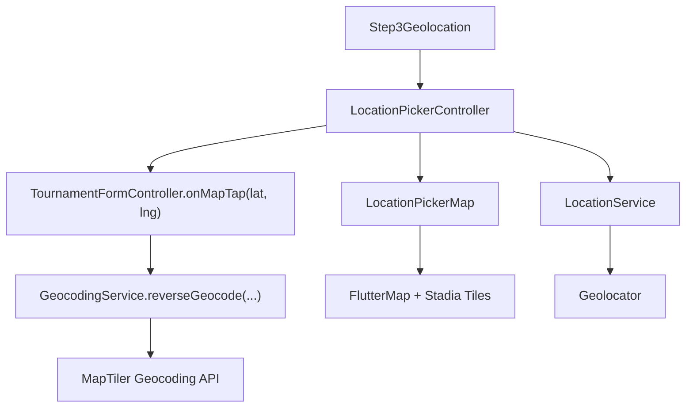

# Geolocalizacion y mapas

## Objetivo

Este documento explica como funciona la implementacion actual de geolocalizacion del formulario de torneos, que componentes intervienen y donde se encuentran centralizadas las API keys relacionadas con el mapa.

## Resumen rapido

La seleccion manual de ubicacion del torneo sigue este comportamiento:

- el mapa puede moverse libremente sin modificar la ubicacion seleccionada;
- la ubicacion solo cambia cuando el usuario hace `tap` sobre un punto concreto del mapa;
- el marcador solo aparece cuando existe una ubicacion seleccionada;
- una vez colocado, el marcador permanece fijo en esas coordenadas hasta un nuevo `tap`;
- el mapa usa tiles de Stadia Maps con estilo visual `osm_bright`;
- la busqueda y geocodificacion inversa usan MapTiler;
- la obtencion de la posicion actual del dispositivo usa `geolocator`.

## Archivos principales

### 1. Configuracion de proveedor y API keys

Archivo:

- `lib/features/tournament/config/map_provider_config.dart`

Responsabilidad:

- centraliza las keys y endpoints del sistema de mapa;
- define la URL template de Stadia Maps;
- define el host y parametros base para MapTiler.

Actualmente contiene:

- `stadiaApiKey`
- `mapTilerApiKey`
- `stadiaTileUrlTemplate`
- `mapTilerHost`
- `geocodingLanguage`
- `userAgentPackageName`

## Donde estan las API keys

Las API keys estan hardcodeadas actualmente en:

- `lib/features/tournament/config/map_provider_config.dart`

Concretamente:

- `TournamentMapProviderConfig.stadiaApiKey`
- `TournamentMapProviderConfig.mapTilerApiKey`

Esto permite que toda la app consuma las keys desde un unico punto y evita tener URLs o secretos repetidos en widgets o servicios.

## Flujo de alto nivel

## Componentes y responsabilidades

### `Step3Geolocation`

Archivo:

- `lib/features/tournament/presentation/screens/form/steps/step3_geolocation.dart`

Responsabilidad:

- integra el buscador y el mapa en el paso 3 del formulario;
- crea el `LocationPickerController`;
- sincroniza las coordenadas guardadas en el formulario con el estado visual del mapa;
- delega la persistencia real de latitud y longitud al `TournamentFormController`.

### `LocationPickerController`

Archivo:

- `lib/features/tournament/presentation/controllers/location_picker_controller.dart`

Responsabilidad:

- mantiene el estado de UX del mapa;
- expone estados `loading`, `error` y `success`;
- centra el mapa en la ubicacion actual cuando se inicializa el flujo;
- procesa el `tap` sobre el mapa;
- conserva la ubicacion seleccionada aunque el usuario mueva el mapa.

Puntos importantes:

- `bootstrap()` inicia el flujo de centrado inicial;
- `centerOnUserLocation()` obtiene la posicion del dispositivo, pero no cambia una seleccion previa hecha manualmente;
- `handleMapTap(LatLng point)` es el punto de entrada principal para seleccionar ubicacion manual;
- `handlePositionChanged(...)` solo actualiza camara y zoom, no cambia la seleccion;
- `_commitSelection(...)` actualiza el estado y notifica al formulario.

### `LocationPickerMap`

Archivo:

- `lib/features/tournament/presentation/screens/form/widgets/location_picker_map.dart`

Responsabilidad:

- renderiza el `FlutterMap`;
- configura los tiles de Stadia Maps;
- conecta el `onTap` del mapa con el controller;
- dibuja el marcador dinamico con `MarkerLayer`;
- muestra feedback visual de carga, error y ayuda al usuario.

Puntos tecnicos importantes:

- usa `MapOptions.onTap` para convertir el toque en un `LatLng`;
- usa `MarkerLayer` para posicionar el pin exactamente en las coordenadas seleccionadas;
- el marcador se renderiza solo si `controller.selectedPoint != null`;
- mover o hacer zoom no altera el `selectedPoint`.

### `LocationService`

Archivo:

- `lib/features/tournament/data/services/location_service.dart`

Responsabilidad:

- encapsula todo el acceso al GPS mediante `geolocator`;
- valida permisos;
- valida si el servicio de ubicacion del dispositivo esta activo;
- devuelve una posicion actual o lanza un error controlado.

### `GeocodingService`

Archivo:

- `lib/features/tournament/data/services/geocoding_service.dart`

Responsabilidad:

- buscar direcciones o lugares por texto;
- convertir coordenadas a una direccion legible;
- comunicarse con la API de MapTiler.

Uso actual:

- `search(query)` para las sugerencias del buscador;
- `reverseGeocode(lat, lng)` despues de seleccionar un punto en el mapa.

### `TournamentFormController`

Archivo:

- `lib/features/tournament/presentation/controllers/tournament_form_controller.dart`

Responsabilidad dentro del flujo de geolocalizacion:

- guarda `latitude` y `longitude`;
- actualiza el texto de direccion en `locationController`;
- valida que la ubicacion tenga tanto texto como coordenadas reales;
- ejecuta la geocodificacion inversa despues de un `tap`.

Metodo clave:

- `onMapTap(double lat, double lng)`

Ese metodo:

1. guarda las coordenadas elegidas;
2. limpia sugerencias previas;
3. llama a `GeocodingService.reverseGeocode(...)`;
4. escribe la direccion resultante en el campo de texto;
5. si no hay direccion disponible, deja un fallback con coordenadas.

## Flujo detallado de seleccion manual

### Caso 1: inicio del mapa

1. `Step3Geolocation` crea `LocationPickerController`.
2. `bootstrap()` intenta centrar la camara en la ubicacion actual del dispositivo.
3. el mapa puede quedar centrado en la posicion real o en un fallback.
4. todavia no hay seleccion manual si el usuario no ha tocado el mapa.

### Caso 2: el usuario toca el mapa

1. `FlutterMap` dispara `onTap`.
2. `LocationPickerMap` llama a `controller.handleMapTap(point)`.
3. `LocationPickerController` guarda ese `LatLng` como seleccion actual.
4. el controller invoca `onLocationConfirmed(point)`.
5. `Step3Geolocation` delega en `TournamentFormController.onMapTap(lat, lng)`.
6. el formulario guarda coordenadas y resuelve la direccion con `reverseGeocode`.
7. `LocationPickerMap` vuelve a renderizarse y muestra el `MarkerLayer` en ese punto exacto.

### Caso 3: el usuario mueve el mapa despues

1. el usuario arrastra o hace zoom.
2. `handlePositionChanged(...)` solo actualiza centro y zoom de camara.
3. la seleccion NO cambia.
4. el marcador sigue anclado a la ultima coordenada seleccionada.

### Caso 4: el usuario toca un nuevo punto

1. se repite el flujo de `onTap`;
2. la nueva coordenada reemplaza a la anterior;
3. el marcador se reubica en el nuevo punto.

## Por que el marcador ya no esta fijo en el centro

Antes, la UX seguia el patron de "muevo el mapa y selecciono lo que queda debajo del pin".

Ahora, la implementacion sigue un patron mas cercano a Google Maps para seleccion manual explicita:

- el usuario inspecciona el mapa libremente;
- la seleccion sucede solo por accion explicita de `tap`;
- el marcador representa una seleccion persistente, no una posicion temporal de la camara.

Esto reduce ambiguedad y hace mas predecible el comportamiento.

## Consideraciones tecnicas de precision

- `flutter_map` ya entrega el `LatLng` correcto en `onTap`, por lo que no hace falta convertir manualmente pixeles de pantalla en este flujo;
- `MarkerLayer` se encarga de proyectar correctamente las coordenadas al sistema del mapa;
- el pin usa `alignment: Alignment.topCenter` para que la punta del marcador coincida con la coordenada;
- el marcador queda estable al hacer zoom o pan porque esta anclado a coordenadas geograficas, no a posicion fija de pantalla.

## Estados de UX soportados

El controller maneja tres estados:

- `loading`: mientras se intenta obtener la ubicacion del dispositivo;
- `error`: cuando faltan permisos o falla la ubicacion;
- `success`: cuando el mapa esta disponible para interaccion normal.

Ademas:

- si el usuario ya habia elegido una ubicacion, recentrar en "mi ubicacion" no sobreescribe esa seleccion;
- solo un nuevo `tap` cambia la ubicacion elegida.

## Recomendacion de seguridad

Aunque ahora las keys estan centralizadas, siguen dentro del codigo fuente.

Para un entorno de produccion, la recomendacion es migrarlas a:

- `--dart-define`
- variables de entorno en CI/CD
- o un sistema de configuracion por entorno

Mientras no se haga ese cambio, el punto oficial de mantenimiento sigue siendo:

- `lib/features/tournament/config/map_provider_config.dart`
